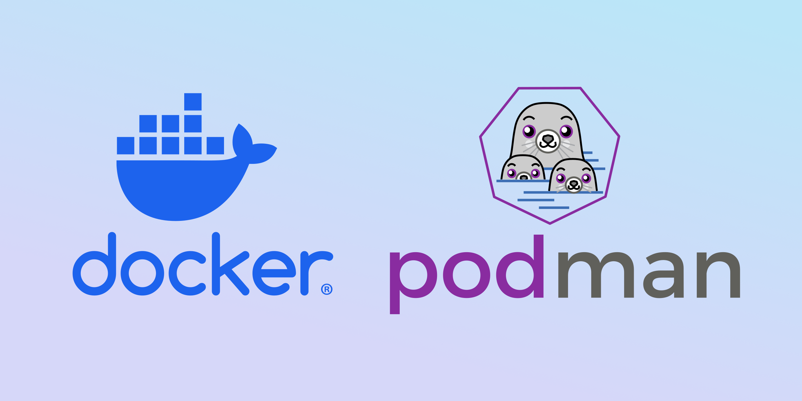
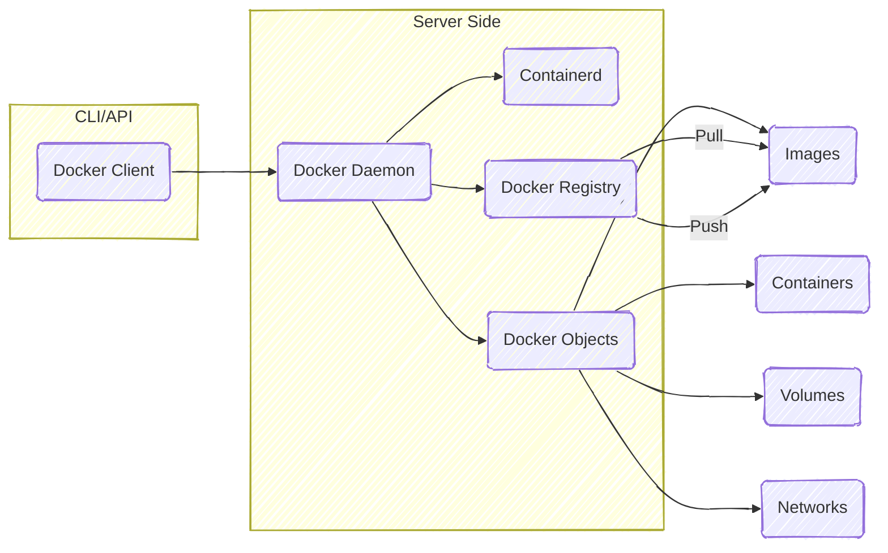
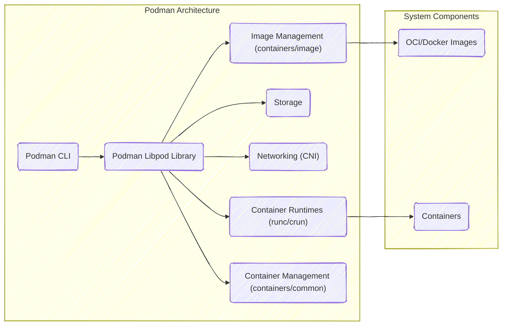

# Docker versus Podman: A Comparison

:::info

This article expects readers to have some knowledge of containerization and
virtualization in general. If you are new to the topic, consider reading
introductory materials. You can also check out my detailed writings on
[**Docker**](/notes/software-and-system-engineering/docker/) and
[**Podman**](/notes/software-and-system-engineering/podman/).

:::

[**Docker**](https://www.docker.com) and [**Podman**](https://podman.io) are two
popular containerization tools that have gained significant traction in the
software development and deployment landscape. Both tools provide the ability to
create, manage, and deploy containers, but they have different architectures and
philosophies. In this article, we will compare them, highlighting their key
differences, advantages, and disadvantages.

## What is Containerization?

Containerization is a lightweight form of **virtualization**[^virtualization]
that allows developers to package applications and their dependencies into
isolated environments called containers. This approach ensures that applications
run consistently across different environments, such as development, testing,
and production, as well as across different operating systems. Containers share
the host operating system's kernel, making them more efficient than traditional
**virtual machines**[^vm].

## Docker

Docker is a platform that provides a set of tools for building, running, and
managing containers. It was first released in 2013 and has since become the de
facto standard for containerization. Docker offers a user-friendly command-line
interface (CLI) and a graphical user interface (GUI) called Docker Desktop,
which make it easy to manage containers and images.

### Architecture

Docker uses a client-server architecture, where the Docker client communicates
with the Docker daemon to manage containers. The Docker daemon runs as a
background service and is responsible for managing containers, images, networks,
and volumes. The Docker client sends commands to the daemon, which then executes
them. This architecture allows for easy management of containers, but it also
means that the Docker daemon must be running for any container operations to
succeed.

- **Docker Client (CLI or REST API)**: The interface used to communicate with
  the Docker daemon.
- **Docker Daemon (`dockerd`)**: The main service that manages containers,
  images, and more.
- **Containerd**: The container runtime Docker uses under the hood.
- **Docker Objects**: Includes images, containers, volumes, and networks.
- **Docker Registry**: Stores Docker images (e.g., Docker Hub or private
  registries).

### Advantages of Docker

- **Mature Ecosystem**: Docker has a large and mature ecosystem with extensive
  documentation, community support, and third-party tools.
- **User-Friendly**: Docker provides a user-friendly CLI and GUI, making it easy
  for developers to get started with containerization.
- **Wide Adoption**: Docker is widely adopted in the industry, making it easier
  to find resources, tutorials, and community support.

### Disadvantages of Docker

- **Daemon Dependency**: Docker requires the Docker daemon to be running, which
  can be a single point of failure and may introduce security concerns.
- **Root Privileges**: Docker typically requires root privileges to run, which
  can pose security risks, especially in multi-tenant environments.
- **Complexity**: Docker's architecture can be complex, especially for
  beginners. The interaction between the Docker client, daemon, and containerd
  can be confusing.

## Podman

Podman is a container management tool developed by Red Hat and released in 2018.
It is designed to be a drop-in replacement for Docker, providing a similar
command-line interface and functionality. However, Podman has a key difference:
it does not require a daemon to run. Instead, Podman uses a daemon-less
architecture, meaning each Podman command runs as a separate process. This
approach provides better security and allows users to run containers without
requiring root privileges.

### Architecture

Podman's architecture is simpler than Docker's, as it does not rely on a central
daemon. Each Podman command runs as a separate process, allowing users to run
containers without a long-running service. Podman uses the `containerd` runtime
for managing containers, similar to Docker, but it does not require a daemon to
manage them.

- **Daemon-less**: Podman does not require a background service like Docker.
- **Rootless Support**: Containers can be run securely by non-root users.
- **Libpod Library**: The core library that manages pods, containers, and
  images.
- **runc/crun**: OCI-compliant container runtimes used to run containers.
- **CNI**: Container Network Interface plugins for networking.
- **containers/image & containers/common**: Libraries for image handling and
  shared utilities.

### Advantages of Podman

- **Daemon-less Architecture**: Podman does not require a long-running daemon,
  reducing complexity and potential security risks.
- **Rootless Containers**: Podman allows users to run containers without root
  privileges, enhancing security in multi-tenant environments.
- **Compatibility with Docker**: Podman provides a Docker-compatible CLI, making
  it easy for Docker users to transition to Podman without significant changes
  to their workflows.

### Disadvantages of Podman

- **Less Mature Ecosystem**: Podman is newer than Docker, so its ecosystem is
  less mature, with fewer third-party tools and resources available.
- **Compatibility Issues**: While Podman aims to be Docker-compatible, there may
  be some differences in behavior or features that can cause compatibility
  issues with existing Docker workflows.

## Comparison

| **Feature**             | **Docker**                                 | **Podman**                                                 |
| :---------------------- | :----------------------------------------- | :--------------------------------------------------------- |
| **What it is**          | Container engine                           | Container engine (daemon-less)                             |
| **Developed by**        | Docker Inc.                                | Red Hat                                                    |
| **Released in**         | 2013                                       | 2018                                                       |
| **Daemon**              | Yes (monolithic `dockerd` daemon)          | No (daemon-less)                                           |
| **Rootless mode**       | Available, but less mature                 | Native and first-class support                             |
| **Container runtime**   | Uses `containerd` under the hood           | Uses `runc` or can integrate with `CRI-O`                  |
| **Client-server model** | Yes (Docker client talks to Docker daemon) | No (Podman runs commands directly)                         |
| **Systemd integration** | Indirect or through wrappers               | Native systemd unit generation (`podman generate systemd`) |
| **CLI compatibility**   | Native                                     | Docker CLI-compatible (`alias docker=podman`)              |
| **Swarm mode**          | Yes                                        | No                                                         |
| **Kubernetes support**  | Not native, but with 3rd party             | Native (`podman generate kube`)                            |
| **Image build**         | `docker build`                             | `podman build` or Buildah (under the hood)                 |
| **Docker Compose**      | Supported with `docker-compose`            | Podman Compose (`podman-compose`, community-supported)     |
| **Rootless containers** | Available                                  | Default / preferred mode                                   |
| **User namespaces**     | Optional                                   | Used extensively                                           |
| **SELinux support**     | Limited                                    | Native SELinux integration                                 |

## Conclusion

When choosing between Docker and Podman, there is no one-size-fits-all solution.
Consider your specific use case and requirements. Both tools have their
strengths and weaknesses, and the best choice depends on your needs. Here are
some scenarios where each tool might be more suitable:

**Choose Docker if**:

- You need a mature ecosystem with extensive community support.
- You prefer a user-friendly CLI and GUI for managing containers.
- You are already using Docker in your development workflow and want to maintain
  compatibility.

**Choose Podman if**:

- You prioritize security and want to run containers without root privileges.
- You prefer a simpler, daemon-less architecture.
- You want to leverage systemd integration for managing containers as system
  services.

## Further Exploration

- [**Docker Documentation**](https://docs.docker.com): Official documentation
  for Docker.
- [**Podman Documentation**](https://podman.io/docs): Official documentation for
  Podman.
- [**The differences between Docker, containerd, CRI-O and runc**](https://www.tutorialworks.com/difference-docker-containerd-runc-crio-oci/):
  A detailed explanation of the differences between Docker, containerd, CRI-O,
  and runc.
- [**The Moby Project**](https://mobyproject.org): Moby is an open-source
  project that provides the components for building container-based systems,
  including the Docker Engine.

---

[^virtualization]:
    Virtualization is a technology that allows multiple operating systems to run
    on a single physical machine, providing isolation and resource management.

[^vm]:
    Virtual machines (VMs) are software emulations of physical computers that
    run an entire operating system, including its kernel. They provide strong
    isolation and can run different OSes on the same hardware, but they are more
    resource intensive compared to containers.
