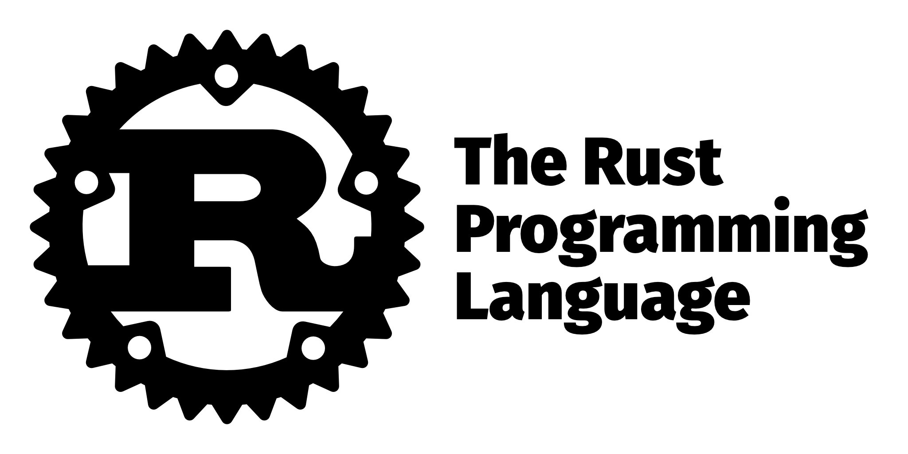

# More Data Types in Rust

<div className="center-image-and-caption">



</div>

In addition to the [**basic data types**](/articles/basic-data-types-in-rust/),
Rust also supports more complex data types such as vectors, slices, strings, and
others. These data types allow for more sophisticated data management and
manipulation, similar to those found in other programming languages.

## Vectors

:::tip[Documentation]

- [**The Rust Programming Language: Vectors**](https://doc.rust-lang.org/book/ch08-01-vectors.html)

:::

Vectors are similar to arrays but are dynamically sized. They can grow or shrink
in size as needed. Vectors are created using the `Vec<T>` type, where `T` is the
type of elements stored in the vector.

```rust title="main.rs"
fn main() {
    // Creating a new empty vector
    let mut vector_var: Vec<i32> = Vec::new();

    // Adding elements to the vector
    vector_var.push(1);
    vector_var.push(2);
    vector_var.push(3);
    println!("Vector: {:?}", vector_var);
    println!("Vector length: {}", vector_var.len());
    println!("First element: {}", vector_var[0]);
    println!("Second element: {}", vector_var[1]);
    println!("Third element: {}", vector_var[2]);
    println!("Last element: {}", vector_var[vector_var.len() - 1]);

    // Similar to arrays, if vector is empty, accessing the last element with
    // length - 1 will cause a panic. To avoid that, we can use the `last`
    // method with `unwrap_or` to provide a default value.
    println!("Last element: {}", vector_var.last().unwrap_or(&-1));

    // Removing the last element from the vector
    vector_var.pop();
    println!("Vector after pop: {:?}", vector_var);
    println!("Vector length after pop: {}", vector_var.len());
    println!("Last element: {}", vector_var.last().unwrap_or(&-1));

    // Removing an element at a specific index
    vector_var.remove(0);
    println!("Vector after removing index 0: {:?}", vector_var);
    println!("Vector length after removing index 0: {}", vector_var.len());
    println!("First element after removing index 0: {}", vector_var[0]);
    println!("Last element: {}", vector_var.last().unwrap_or(&-1));
}
```

Vectors can also be created using the `vec!` macro:

```rust title="main.rs"
fn main() {
    // Creating a vector using the vec! macro
    let vector_var = vec![1, 2, 3, 4, 5];
    println!("Vector: {:?}", vector_var);
    println!("Vector length: {}", vector_var.len());
    println!("First element: {}", vector_var[0]);
    println!("Last element: {}", vector_var.last().unwrap_or(&-1));
}
```

## Slices

:::tip[Documentation]

- [**The Rust Programming Language: Slices**](https://doc.rust-lang.org/book/ch04-03-slices.html)

:::

Slices are a view into a contiguous sequence of elements in a collection, such
as an array or a vector. They do not own the data they point to, which means
they are lightweight and efficient, and are often used to reference a portion of
an array or a vector without taking ownership of the entire collection. Slices
are created using the `&[T]` type, where `T` is the type of elements in the
slice.

```rust title="main.rs"
fn main() {
    // Creating a slice from an array
    let array_var = [1, 2, 3, 4, 5];

    // Slice from index 1 to 3
    let slice_var: &[i32] = &array_var[1..4];

    // Printing the slice and its properties
    println!("Slice: {:?}", slice_var);
    println!("Slice length: {}", slice_var.len());
    println!("First element of slice: {}", slice_var[0]);
    println!("Second element of slice: {}", slice_var[1]);
    println!("Third element of slice: {}", slice_var[2]);
    println!("Last element of slice: {}", slice_var[slice_var.len() - 1]);

    // If slice is empty, accessing the last element with length - 1 will cause
    // a panic, similar to arrays and vectors. To avoid that, we can use the
    // `last` method with `unwrap_or` to provide a default value.
    println!("Last element of slice: {}", slice_var.last().unwrap_or(&-1));
}
```

```rust title="main.rs"
fn main() {
    // Creating a slice from a vector
    let vector_var = vec![1, 2, 3, 4, 5];

    // Slice from index 1 to 3
    let slice_var: &[i32] = &vector_var[1..4];

    // Printing the slice and its properties
    println!("Slice: {:?}", slice_var);
    println!("Slice length: {}", slice_var.len());
    println!("First element of slice: {}", slice_var[0]);
    println!("Second element of slice: {}", slice_var[1]);
    println!("Third element of slice: {}", slice_var[2]);
    println!("Last element of slice: {}", slice_var.last().unwrap_or(&-1));
}
```

## Strings

:::tip[Documentation]

- [**The Rust Programming Language: Strings**](https://doc.rust-lang.org/book/ch08-02-strings.html)

:::

Strings in Rust are represented by the `String` type, which is a growable,
heap-allocated data structure. Strings are UTF-8 encoded, allowing for a wide
range of characters. Strings can be created using the `String::new()` function,
the `String::from()` function, or by converting a string literal using the
`to_string()` method.

```rust title="main.rs"
fn main() {
    // Creating a new empty String
    let mut s1 = String::new();

    // Creating a String from a string literal
    let s2 = String::from("Hello, Rust!");

    // Converting a string literal to a String
    let s3 = "Hello, Rust!".to_string();

    // Appending to a String
    s1.push_str("Hello");
    s1.push(',');
    s1.push(' ');
    s1.push_str("Rust!");

    // Printing the Strings
    println!("s1: {}", s1);
    println!("s2: {}", s2);
    println!("s3: {}", s3);
}
```

Another way to handle strings is through string slices, which are references to
a portion of a string. String slices are denoted by the `&str` type and are
commonly used for string literals.

```rust title="main.rs"
fn main() {
    // String slice from a string literal
    let str_slice: &str = "Hello, Rust!";
    println!("String slice: {}", str_slice);
}
```

The difference between `String` and `&str` is that `String` is a growable,
heap-allocated data structure, while `&str` is a reference to a string slice,
which is usually immutable and points to a specific portion of a string. A more
detailed difference is that `String` is an owned type, meaning it has ownership
of the string data and is responsible for managing its memory. On the other
hand, `&str` is a borrowed type, meaning it references string data owned by
another variable.

:::info

More about ownership and borrowing will be covered later.

:::
