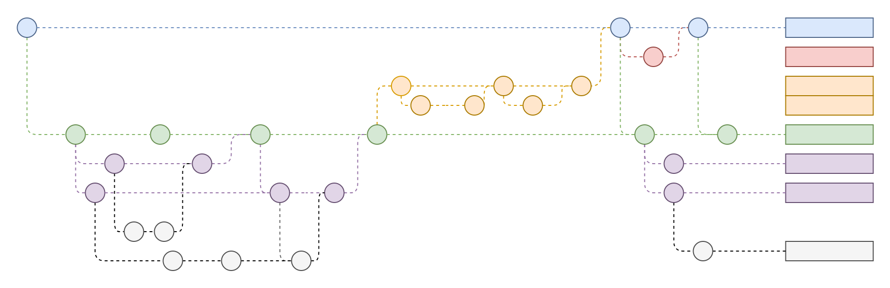
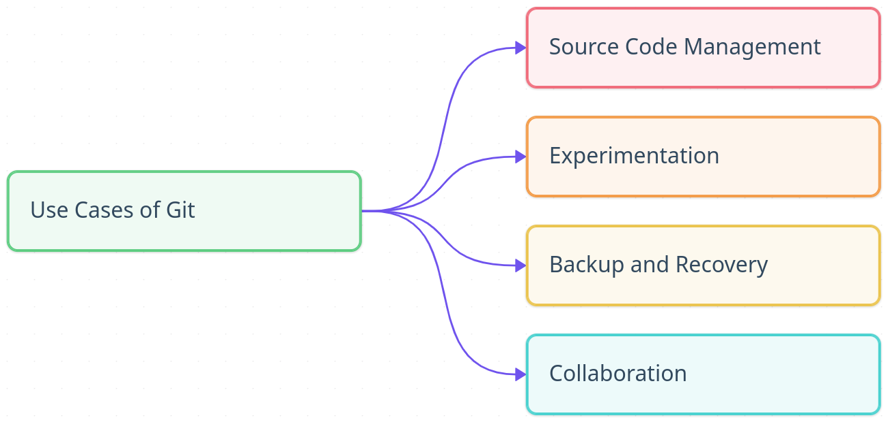
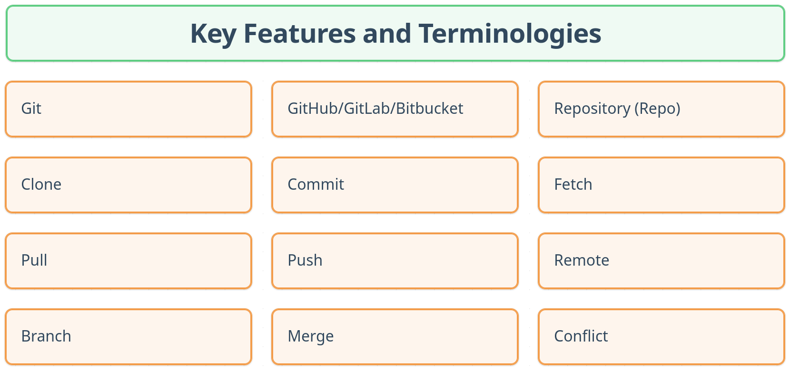

# What is Git?

It is nearly impossible not to have heard the term "Git" in the software
development world. But what exactly is Git, and why is it so widely used, and
how does it work? So let's try to explore the fundamentals of Git, its purpose,
and its key features and terminologies.

## Definition of Git

> _Git is a distributed version control system that helps developers track
> changes in their codebase, manage different versions of their projects, and
> collaborate with others._

Well, that's a mouthful! Let's break it down into simpler terms.

### Version Control System (VCS)

A Version Control System (VCS) is a tool that helps manage changes to files over
time. It allows to keep track of who made what changes, when they were made, and
why. A simpler analogy would be a "save" feature in a video game, where progress
can be saved at different points and return to those points later if needed. Or
Google Docs, where revision history of a document can be seen and revert to
previous versions if necessary.

### Distributed Version Control System (DVCS)

But why distributed? In a distributed version control system, every developer
has a complete copy of the entire repository, including its history, on their
local machine. This means that they can work offline, make changes, and commit
them locally without needing to be connected to a central server. When changes
are ready to be shared, they can be pushed to a remote repository, and other
developers can pull those changes to their local copies.

### Collaboration

One of the key features of Git is its ability to facilitate collaboration among
multiple developers. With Git, teams can work on the same codebase
simultaneously, making changes, fixing bugs, and adding new features without
stepping on each other's toes. Git provides mechanisms for merging changes from
different developers, resolving conflicts, and maintaining a coherent history of
the project.

## Use Cases of Git

After understanding what Git is, let's look at some common use cases and why it
is so popular:

- **Source Code Management**: Git is primarily used for managing source code in
  software development projects. It allows developers to track changes, maintain
  a history of the codebase, and collaborate.
- **Experimentation**: Git's branching and merging capabilities allow developers
  to create separate branches for new features or experiments without affecting
  the main codebase.
- **Backup and Recovery**: With Git, every developer has a complete copy of the
  repository, providing a built-in backup mechanism. If something goes wrong,
  it's easy to revert to a previous state.
- **Collaboration**: Git enables multiple developers to work on the same project
  simultaneously, making it easier to share code, review changes, and merge
  contributions.

## Key Features and Terminologies

Let's explore some of the key features and terminologies associated with Git to
build the groundwork for further understanding.

:::info

These are basic terminologies to get started with Git. The
[**Glossary**](/notes/git/glossary/) section can be referred for a comprehensive
list of Git terminologies.

:::

- **Git**: The name of the version control system itself, the command-line tool
  used to interact with repositories, and the underlying technology that powers
  version control.
- **GitHub/GitLab/Bitbucket**: These are popular web-based platforms that
  provide hosting for Git repositories, along with additional features like
  issue tracking, pull requests, and collaboration tools.
- **Repository (Repo)**: A repository is a storage location for a project,
  simply a folder or directory containing all the files, history, and metadata
  associated with the project. It can be local (on machine) or remote (hosted on
  a platform like GitHub).
- **Clone**: Cloning is the process of creating a local copy of a remote
  repository. This allows developers to work on the project locally and push
  their changes back to the remote repository when ready.
- **Commit**: A commit is a snapshot of the changes made to the files in the
  repository. Each commit has a unique identifier (hash) and includes
  information about the author, date, and a message describing the changes.
- **Fetch**: Fetching is the process of downloading changes from a remote
  repository without merging them into the local copy. This allows developers to
  see what changes are available before deciding to pull them.
- **Pull**: Pulling is the process of fetching changes from a remote repository
  and merging them into the local copy. This is typically done to keep the local
  repository up-to-date with the latest changes from other developers.
- **Push**: Pushing is the process of sending local commits to a remote
  repository. This is how developers share their changes with others.
- **Remote**: A remote is a reference to a remote repository, typically hosted
  on a platform like GitHub. It allows developers to interact with the remote
  repository, such as fetching, pulling, and pushing changes.
- **Branch**: A branch is a separate line of development in a Git repository. It
  allows developers to work on new features or bug fixes without affecting the
  main codebase. The default branch is usually called **main** or **master**.
- **Merge**: Merging is the process of combining changes from one branch into
  another. This is typically done when a feature or bug fix is complete and
  ready to be integrated into the main codebase.
- **Conflict**: A conflict occurs when changes made in one branch cannot be
  automatically merged with changes in another branch. Conflicts need to be
  resolved manually by the developer.

## Summary

In this article, an introduction to Git has been provided, including its
purpose, key features, and terminologies. Git is a powerful tool for version
control and collaboration, and understanding its fundamentals is essential for
anyone involved in software development. Installation and configuration of Git
will be covered in the [**next article**](/articles/hello-git/). Happy coding!
