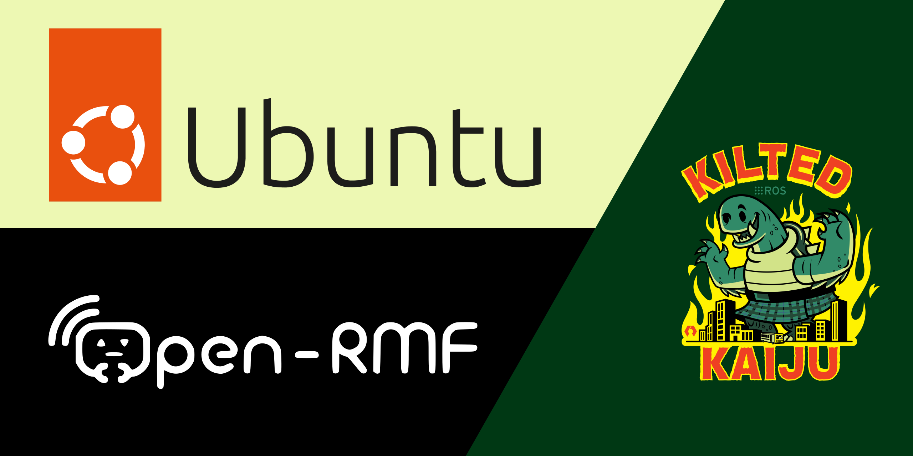

# Guide to Install Open-RMF on Ubuntu 24.04 with ROS 2 Kilted Kaiju



:::info

This guide provides step-by-step instructions to install Open-RMF on Ubuntu
24.04 with ROS 2 Kilted Kaiju. Keep in mind that this guide assumes you have a
basic understanding of Linux commands and ROS 2 concepts.

:::

Open-RMF (Open Robotics Middleware Framework) is an open-source middleware
framework designed to integrate different robotic systems and infrastructure for
coordinated fleet management and automation. This guide covers installing
dependencies, setting up the workspace, and running a demo.

## Requirements

- **Memory (RAM)**: 16 GB recommended (8 GB minimum but note that the
  [**Gazebo**](https://gazebosim.org/home) simulation in the demo may not run
  properly with only 8 GB)
- **Operating System**:
  [**Ubuntu 24.04 LTS (Noble Numbat)**](https://releases.ubuntu.com/noble/)
- **Robot Operating System (ROS)**:
  [**ROS 2 Kilted Kaiju**](https://docs.ros.org/en/kilted/index.html)

## Setup ROS 2 Kilted Kaiju

### Set Locale

Make sure you have a locale that supports UTF-8. If you are in a minimal
environment (such as a Docker container), the locale may be something minimal
like POSIX. You can test with the following settings, but any UTF-8-supported
locale should work.

```shell
# Check for UTF-8 support
locale

# If not set, configure the locale
sudo apt update
sudo apt install -y locales
sudo locale-gen en_US en_US.UTF-8
sudo update-locale LC_ALL=en_US.UTF-8 LANG=en_US.UTF-8
export LANG=en_US.UTF-8

# Verify settings
locale
```

### Install Build Tools

```shell
sudo apt update
sudo apt upgrade -y
sudo apt install -y build-essential
```

### Add ROS 2 Kilted Kaiju Repository

You need to add the ROS 2 APT repository to your system.

First, ensure that the
[**Ubuntu Universe Repository**](https://help.ubuntu.com/community/Repositories/Ubuntu)
is enabled:

```shell
sudo apt install -y software-properties-common
sudo add-apt-repository -y universe
```

Install the
[**ros-apt-source**](https://github.com/ros-infrastructure/ros-apt-source/)
package, which provides keys and APT source configuration for the ROS
repositories:

```shell
sudo apt update
sudo apt install -y curl
export ROS_APT_SOURCE_VERSION=$(curl -s https://api.github.com/repos/ros-infrastructure/ros-apt-source/releases/latest | grep -F "tag_name" | awk -F\" '{print $4}')
curl -s -L -o /tmp/ros2-apt-source.deb "https://github.com/ros-infrastructure/ros-apt-source/releases/download/${ROS_APT_SOURCE_VERSION}/ros2-apt-source_${ROS_APT_SOURCE_VERSION}.$(. /etc/os-release && echo $VERSION_CODENAME)_all.deb" # For Ubuntu derivatives, use $UBUNTU_CODENAME
sudo apt install -y /tmp/ros2-apt-source.deb
```

### Install Development Tools

As we need to build ROS packages and perform other development tasks, install
the development tools:

```shell
sudo apt update
sudo apt install -y ros-dev-tools
```

### Install ROS 2 Kilted Kaiju

To install the desktop version of ROS 2 (includes ROS, RViz, demos, and
tutorials):

```shell
sudo apt update
sudo apt upgrade -y
sudo apt install -y ros-kilted-desktop
```

### Setup Environment

Set up your shell environment by sourcing the following file. To make it
persistent, add it to your `.bashrc`:

```shell
source /opt/ros/kilted/setup.bash
```

:::info

Replace `.bash` with your shell if you are not using Bash. Options include:
`setup.bash`, `setup.sh`, `setup.zsh`.

:::

### Try Examples

As `ros-kilted-desktop` has been installed, you can run some example nodes.

In one terminal, source the setup file and run a C++ `talker`:

```shell
source /opt/ros/kilted/setup.bash
ros2 run demo_nodes_cpp talker
```

In another terminal, source the setup file and run a Python `listener`:

```shell
source /opt/ros/kilted/setup.bash
ros2 run demo_nodes_py listener
```

You should see the `talker` publishing messages and the `listener` receiving
them. This verifies that both the C++ and Python APIs are functioning correctly.

## Setup Open-RMF (Open Robotics Middleware Framework)

### Installing Dependencies

Install all **non-ROS** dependencies of Open-RMF packages:

```shell
sudo apt update
sudo apt upgrade -y
sudo apt install -y python3-fastapi \
  python3-requests \
  python3-shapely \
  python3-socketio \
  python3-yaml \
  ros-kilted-ros-gz-bridge
```

### Setup and Update `rosdep`

[**`rosdep`**](http://wiki.ros.org/rosdep) helps you easily install system
dependencies for source code packages.

```shell
# Run this only the first time
sudo rosdep init

# Always run this before building ROS workspaces
rosdep update
```

### Update `colcon mixin`

`colcon mixins` help configure `colcon` for easier builds using predefined
settings.

```shell
colcon mixin add default https://raw.githubusercontent.com/colcon/colcon-mixin-repository/master/index.yaml
colcon mixin update default
```

### Install Open-RMF

Install the core Open-RMF Debian packages via `apt`.

```shell
sudo apt update
sudo apt install -y ros-kilted-rmf-dev
```

### Install Demos and Other Packages

:::info

The above installation only installs core Open-RMF packages. To run demos and
additional tooling, clone the full source repositories below.

:::

```shell
# Setup directories
cd ~/
mkdir -p ~/rmf_ws/src
cd ~/rmf_ws/src

# Clone the RMF repositories
git clone -b kilted https://github.com/open-rmf/rmf_utils.git
git clone -b kilted https://github.com/open-rmf/rmf_ros2.git
git clone -b kilted https://github.com/open-rmf/rmf_traffic.git
git clone -b kilted https://github.com/open-rmf/rmf_traffic_editor.git
git clone -b kilted https://github.com/open-rmf/rmf_demos.git
```

These repositories include demos and packages such as:

- [**`rmf_utils`**](https://github.com/open-rmf/rmf_utils/tree/kilted/rmf_utils)
- [**`rmf_charging_schedule`**](https://github.com/open-rmf/rmf_ros2/tree/kilted/rmf_charging_schedule)
- [**`rmf_fleet_adapter`**](https://github.com/open-rmf/rmf_ros2/tree/kilted/rmf_fleet_adapter)
- [**`rmf_fleet_adapter_python`**](https://github.com/open-rmf/rmf_ros2/tree/kilted/rmf_fleet_adapter_python)
- [**`rmf_reservation_node`**](https://github.com/open-rmf/rmf_ros2/tree/kilted/rmf_reservation_node)
- [**`rmf_task_ros2`**](https://github.com/open-rmf/rmf_ros2/tree/kilted/rmf_task_ros2)
- [**`rmf_traffic_ros2`**](https://github.com/open-rmf/rmf_ros2/tree/kilted/rmf_traffic_ros2)
- [**`rmf_websocket`**](https://github.com/open-rmf/rmf_ros2/tree/kilted/rmf_websocket)
- [**`rmf_traffic`**](https://github.com/open-rmf/rmf_traffic/tree/kilted/rmf_traffic)
- [**`rmf_traffic_examples`**](https://github.com/open-rmf/rmf_traffic/tree/kilted/rmf_traffic_examples)
- [**`rmf_building_map_tools`**](https://github.com/open-rmf/rmf_traffic_editor/tree/kilted/rmf_building_map_tools)
- [**`rmf_traffic_editor`**](https://github.com/open-rmf/rmf_traffic_editor/tree/kilted/rmf_traffic_editor)
- [**`rmf_traffic_editor_assets`**](https://github.com/open-rmf/rmf_traffic_editor/tree/kilted/rmf_traffic_editor_assets)
- [**`rmf_traffic_editor_test_maps`**](https://github.com/open-rmf/rmf_traffic_editor/tree/kilted/rmf_traffic_editor_test_maps)
- [**`rmf_demos`**](https://github.com/open-rmf/rmf_demos/tree/kilted/rmf_demos)
- [**`rmf_demos_assets`**](https://github.com/open-rmf/rmf_demos/tree/kilted/rmf_demos_assets)
- [**`rmf_demos_bridges`**](https://github.com/open-rmf/rmf_demos/tree/kilted/rmf_demos_bridges)
- [**`rmf_demos_fleet_adapter`**](https://github.com/open-rmf/rmf_demos/tree/kilted/rmf_demos_fleet_adapter)
- [**`rmf_demos_gz`**](https://github.com/open-rmf/rmf_demos/tree/kilted/rmf_demos_gz)
- [**`rmf_demos_maps`**](https://github.com/open-rmf/rmf_demos/tree/kilted/rmf_demos_maps)
- [**`rmf_demos_tasks`**](https://github.com/open-rmf/rmf_demos/tree/kilted/rmf_demos_tasks)

### Build the Workspace

Before building, make sure to source the correct ROS and workspace environments:

```shell
# Source ROS environment
source /opt/ros/kilted/setup.bash

# Optional: Ignore if not yet built
if [ -f ~/rmf_ws/install/setup.bash ]; then
  source ~/rmf_ws/install/setup.bash
fi

cd ~/rmf_ws

# Run a few times if get error due to cross-dependencies
colcon build
```

### Running Demo for Testing

To verify the installation, launch the RMF Gazebo office demo:

```shell
# Go to the RMF workspace
cd ~/rmf_ws

# Source both environments: ROS 2 and RMF workspace
source /opt/ros/kilted/setup.bash
source ~/rmf_ws/install/setup.bash

# Launch demo
ros2 launch rmf_demos_gz office.launch.xml
```

## Setup Open-RMF Web

Following instructions guide you through setting up the **Open-RMF Web**,
including cloning the repository, installing dependencies, and running both
backend and frontend services.

### Clone the Repository

Clone the `rmf-web` repository to your home directory:

```shell
cd ~/
git clone https://github.com/open-rmf/rmf-web.git
cd ~/rmf-web
```

### Install `pnpm` and Node.js

`pnpm` is an efficient package manager used for managing Node.js packages.

```shell
curl -fsSL https://get.pnpm.io/install.sh | bash -
source ~/.bashrc
pnpm env use --global lts  # This will install the latest LTS version of Node.js
```

:::info

You may need to restart your terminal or add the `pnpm` path to your shell
profile like `.bashrc` or `.zshrc`.

:::

### Install Python Virtual Environment Tools

Install Python 3's `pip` and `venv` modules (needed for ROS-related tooling):

```shell
sudo apt install -y python3-pip python3-venv
```

### Install Project Dependencies

Use `pnpm` to install the required JavaScript/TypeScript dependencies:

```shell
cd ~/rmf-web
pnpm install
```

This will install all dependencies defined across the monorepo using `pnpm`.

### Running the Development Environment

After completing installation, you can now run both the backend and frontend
servers. Open **two separate terminal windows/tabs** and follow the steps below.

#### Backend: Start the API Server

Open a new terminal window. The backend powers the API used by the dashboard
frontend.

```shell
# Source ROS 2 and RMF workspace environments
source /opt/ros/kilted/setup.bash
source ~/rmf_ws/install/setup.bash

# Navigate to the API server package
cd ~/rmf-web/packages/api-server

# Start the API server
pnpm start
```

:::info

Any changes to the backend code will require restarting this server.

:::

#### Frontend: Start the Dashboard

In **another terminal window**, start the frontend (dashboard) for live
development.

```shell
# Source ROS 2 and RMF workspace environments
source /opt/ros/kilted/setup.bash
source ~/rmf_ws/install/setup.bash

# Navigate to the dashboard framework package
cd ~/rmf-web/packages/rmf-dashboard-framework

# Start the demo dashboard example
pnpm start:example examples/demo
```

:::info

The frontend rebuilds on changes, but you may need to refresh the browser to see
updates.

:::

#### Access the Dashboard

Once both backend and frontend are running, open your browser and navigate to:
[**http://localhost:5173**](http://localhost:5173)

:::info

**Login Credentials**

If prompted with a login screen:

- **Username**: `admin`
- **Password**: `admin`

---

**Ports Used**

- **Backend (API Server)**: `http://localhost:8000`
- **Frontend (Dashboard)**: `http://localhost:5173`

:::

## Running Demo with Gazebo and optional Web Interface

### Terminal 1: Start the Backend

```shell
# Source ROS 2 and RMF workspace environments
source /opt/ros/kilted/setup.bash
source ~/rmf_ws/install/setup.bash

# Navigate to the API server package
cd ~/rmf-web/packages/api-server

# Start the API server
pnpm start
```

### Terminal 2: Start the Frontend

```shell
# Source ROS 2 and RMF workspace environments
source /opt/ros/kilted/setup.bash
source ~/rmf_ws/install/setup.bash

# Navigate to the dashboard framework package
cd ~/rmf-web/packages/rmf-dashboard-framework

# Start the demo dashboard example
pnpm start:example examples/demo
```

### Terminal 3: Launch the Demo

For Gazebo only:

```shell
# Source ROS 2 and RMF workspace environments
source /opt/ros/kilted/setup.bash
source ~/rmf_ws/install/setup.bash

ros2 launch rmf_demos_gz office.launch.xml
```

For Gazebo **with web browser support**:

```shell
# Source ROS 2 and RMF workspace environments
source /opt/ros/kilted/setup.bash
source ~/rmf_ws/install/setup.bash

ros2 launch rmf_demos_gz office.launch.xml \
  server_uri:="ws://localhost:8000/_internal"
```

### Terminal 4: Send Tasks

```shell
# Source ROS 2 and RMF workspace environments
source /opt/ros/kilted/setup.bash
source ~/rmf_ws/install/setup.bash

# Both of the following tasks are using Office World
# Task 1: Delivery
ros2 run rmf_demos_tasks dispatch_delivery \
  -p pantry \
  -ph coke_dispenser \
  -d hardware_2 \
  -dh coke_ingestor \
  --use_sim_time

# Task 2: Patrol
ros2 run rmf_demos_tasks dispatch_patrol \
  -p coe lounge \
  -n 3 \
  --use_sim_time
```

## Additional Resources

Launch commands and demo-specific instructions are available at the official
[**RMF Demos GitHub repository**](https://github.com/open-rmf/rmf_demos).

## Important Links

- [**Ubuntu 24.04.2 LTS (Noble Numbat)**](https://releases.ubuntu.com/noble/)
- [**ROS 2 Kilted Kaiju Documentation**](https://docs.ros.org/en/kilted/index.html)
- [**ROS 2 Kilted Kaiju Installation Guide for Ubuntu**](https://docs.ros.org/en/kilted/Installation/Ubuntu-Install-Debs.html)
- [**Robotics Middleware Framework (Open-RMF)**](https://github.com/open-rmf/rmf)
- [**Internal RMF Utilities**](https://github.com/open-rmf/rmf_utils)
- [**RMF \<-\> ROS2 Integration Packages**](https://github.com/open-rmf/rmf_ros2)
- [**`rmf_traffic`**](https://github.com/open-rmf/rmf_traffic)
- [**`rmf_traffic_editor`**](https://github.com/open-rmf/rmf_traffic_editor)
- [**RMF Demos**](https://github.com/open-rmf/rmf_demos)
- [**RMF Web**](https://github.com/open-rmf/rmf-web)
