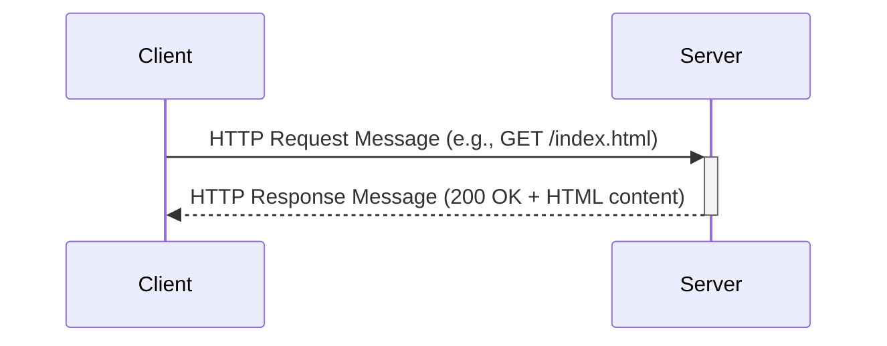
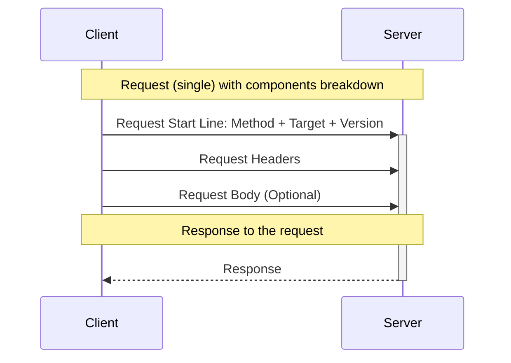
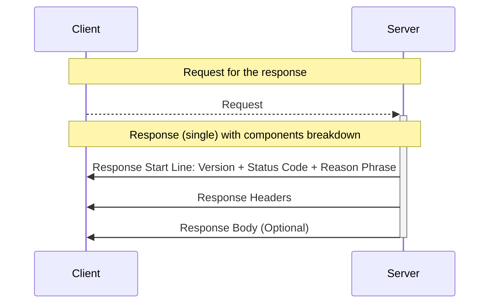

# HTTP Messages

<div className="center-image-and-caption">



</div>

HTTP communication relies on **messages**, which fall into two types:
**requests** sent by clients and **responses** sent by servers. Each message
consists of a **start line**, a set of **headers**, an optional **body**, and a
**terminating sequence**.

<div className="center-text center-table">

|                          | **Description**                                                                                                                                                                                     |
| -----------------------: | :-------------------------------------------------------------------------------------------------------------------------------------------------------------------------------------------------- |
|           **Start Line** | Indicates the nature of the message. For requests, it specifies the method, target resource, and protocol version. For responses, it provides the protocol version, status code, and reason phrase. |
|              **Headers** | Contain key-value pairs that convey metadata, such as content type, encoding, caching directives, and authentication information.                                                                   |
|                 **Body** | Carries the actual data, such as HTML, JSON, or files, if present. Not all messages include a body.                                                                                                 |
| **Terminating Sequence** | Marks the end of the message, typically a blank line (CRLF).                                                                                                                                        |

</div>

## Request Message

Requests are sent by clients to initiate actions on the server. An HTTP request
typically includes: **start line**, **headers**, and an optional **body**.

In a request message, the start line is called the **request line** and has the
following format:

```
METHOD SP REQUEST-URI SP HTTP-VERSION CRLF
```

- `METHOD`: The HTTP method (e.g., `GET`, `POST`, `PUT`, `DELETE`) indicating
  the desired action.
- `REQUEST-URI`: The Uniform Resource Identifier (URI) of the target resource.
- `HTTP-VERSION`: The version of HTTP being used (e.g., HTTP/1.1, HTTP/2).
- `SP`: A single space character.
- `CRLF`: Carriage return and line feed characters marking the end of the line.

Following the request line are the **headers**, which provide additional context
about the request. Common headers include:

- `Host`: Specifies the domain name of the server.
- `User-Agent`: Identifies the client software making the request.
- `Accept`: Indicates the media types the client can process.
- `Authorization`: Contains credentials for authenticating the client.

The **body** of the request is optional and is typically included in methods
like `POST` or `PUT`, where data needs to be sent to the server such as form
submissions or file uploads.

<div className="center-image-and-caption">



</div>

### Methods

The HTTP request method defines the action to be performed. Here is a list of
common HTTP methods:

<div className="center-text center-table">

| **Method** | **Description**                                                         |
| ---------: | :---------------------------------------------------------------------- |
|      `GET` | Retrieve data from the server.                                          |
|     `HEAD` | Similar to `GET` but retrieve headers only without the body.            |
|     `POST` | Submit data to the server (e.g., form submission).                      |
|      `PUT` | Update an existing resource on the server.                              |
|    `PATCH` | Apply partial modifications to a resource.                              |
|   `DELETE` | Remove a resource from the server.                                      |
|  `CONNECT` | Establish a tunnel to the server identified by the target resource.     |
|  `OPTIONS` | Describe the communication options for the target resource.             |
|    `TRACE` | Perform a message loop-back test along the path to the target resource. |

</div>

### Request Target (URI)

The request target, or URI, specifies the resource on the server that the client
wants to interact with. It can take several forms:

- **Absolute URI**: The full URL, including scheme, host, and path (e.g.,
  `http://www.example.com/index.html`).
- **Absolute Path**: The path component of the URL, starting with a slash (e.g.,
  `/index.html`).
- **Authority**: Used with the `CONNECT` method to specify the target server
  (e.g., `www.example.com:443`).
- **Asterisk (`*`)**: Used with the `OPTIONS` method to refer to the entire
  server.

### HTTP Version

The HTTP version indicates the protocol version being used for the request. The
most common versions are:

- **HTTP/1.1**: The most widely used version, supporting persistent connections,
  chunked transfer encoding, and additional headers.
- **HTTP/2**: Introduces multiplexing, header compression, and improved
  performance.
- **HTTP/3**: The latest version, built on QUIC, offering improved speed and
  security.

### Headers

HTTP headers are key-value pairs that provide additional information about the
request. They can control caching, specify content types, manage sessions, and
more. Here are some commonly used request headers:

<div className="center-text center-table">

|        **Header** | **Description**                                        |
| ----------------: | :----------------------------------------------------- |
|            `Host` | Specifies the domain name of the server.               |
|      `User-Agent` | Identifies the client software making the request.     |
|          `Accept` | Indicates the media types the client can process.      |
| `Accept-Language` | Specifies the preferred languages for the response.    |
| `Accept-Encoding` | Indicates the content encodings the client can handle. |
|   `Authorization` | Contains credentials for authenticating the client.    |
|          `Cookie` | Sends cookies from the client to the server.           |
|    `Content-Type` | Describes the media type of the request body.          |
|         `Referer` | Specifies the URL of the referring page.               |

</div>

### Body

The body of an HTTP request is optional and is typically included in methods
like `POST` or `PUT`. It contains the data being sent to the server, such as
form submissions, JSON payloads, or file uploads. The `Content-Type` header
should be set to indicate the media type of the body content such as
`application/json`, `application/x-www-form-urlencoded`, `multipart/form-data`.

### Examples

#### `GET` Request

A simple HTTP `GET` request to fetch a web page might look like this:

```http
GET /index.html HTTP/1.1
Host: www.example.com
User-Agent: Mozilla/5.0 (Windows NT 10.0; Win64; x64) AppleWebKit/537.36 (KHTML, like Gecko) Chrome/100.0.4896.127 Safari/537.36
Accept: text/html,application/xhtml+xml
```

:::info

User-Agent strings can vary widely based on the browser and operating system. A
list of latest user agents strings can be found at:

- [**UserAgents.io**](https://useragents.io/)
- [**What are the latest user agents for popular web browsers?**](https://www.whatismybrowser.com/guides/the-latest-user-agent/)

:::

#### `POST` Request

A simple HTTP `POST` request to submit form data might look like this:

```http
POST /submit HTTP/1.1
Host: www.example.com
User-Agent: Mozilla/5.0 (Windows NT 10.0; Win64; x64) AppleWebKit/537.36 (KHTML, like Gecko) Chrome/100.0.4896.127 Safari/537.36
Content-Type: application/x-www-form-urlencoded

name=Adam&email=adam%40example.com
```

:::info

[**REST Client for Visual Studio Code**](https://marketplace.visualstudio.com/items?itemName=humao.rest-client)
is a good tool to test HTTP requests directly from your code editor and work
with the same format as shown in the examples above.

:::

### Summary

Here is a summary of the main components of an HTTP request:

<div className="center-text center-table">

|                          | **Description**                                                                                                                                                                      |
| -----------------------: | :----------------------------------------------------------------------------------------------------------------------------------------------------------------------------------- |
|               **Method** | Defines the action to be performed. Common methods are `GET` (retrieve data), `POST` (submit data), `PUT` (update data), `DELETE` (remove data), and `HEAD` (retrieve headers only). |
| **Request Target (URI)** | Identifies the resource on the server. This may be an absolute URL or a relative path.                                                                                               |
|         **HTTP Version** | Indicates the protocol version in use, such as HTTP/1.1, HTTP/2, or HTTP/3.                                                                                                          |
|              **Headers** | Provide additional context, such as `Host` (server domain), `User-Agent` (client software), `Accept` (preferred response format), and `Authorization` (credentials).                 |
|      **Body (optional)** | Contains data for the server, typically included in `POST` or `PUT` requests.                                                                                                        |

</div>

## Response Message

Responses are sent by servers to provide the result of the client's request. An
HTTP response typically includes: **start line**, **headers**, and an optional
**body**.

In a response message, the start line is called the **status line** and has the
following format:

```
HTTP-VERSION SP STATUS-CODE SP REASON-PHRASE CRLF
```

- `HTTP-VERSION`: The version of HTTP being used (e.g., HTTP/1.1, HTTP/2).
- `STATUS-CODE`: A three-digit code indicating the result of the request (e.g.,
  `200` for success, `404` for not found).
- `REASON-PHRASE`: A textual description of the status code (e.g., "OK", "Not
  Found").
- `SP`: A single space character.
- `CRLF`: Carriage return and line feed characters marking the end of the line.

Following the status line are the **headers**, which provide additional context
about the response. Common headers include:

- `Content-Type`: Indicates the media type of the response body (e.g.,
  `text/html`, `application/json`).
- `Content-Length`: Specifies the size of the response body in bytes.
- `Set-Cookie`: Used to send cookies from the server to the client.
- `Cache-Control`: Directives for caching mechanisms in both requests and
  responses.

The **body** of the response contains the actual data requested by the client,
such as an HTML page, JSON data, or a file.

<div className="center-image-and-caption">



</div>

### HTTP Version

The HTTP version indicates the protocol version being used for the response.
Similar to requests, the most common versions are: **HTTP/1.1**, **HTTP/2**, and
**HTTP/3**.

### Status Codes

HTTP status codes are three-digit numbers that indicate the outcome of the
request. They are grouped into five categories:

<div className="center-text center-table">

|  **Category** | **Range** | **Description**                                             |
| ------------: | :-------: | :---------------------------------------------------------- |
| Informational |  100-199  | Request received, continuing processing.                    |
|    Successful |  200-299  | Action was successfully received, understood, and accepted. |
|   Redirection |  300-399  | Further action needs to be taken to complete the request.   |
|  Client Error |  400-499  | The request contains bad syntax or cannot be fulfilled.     |
|  Server Error |  500-599  | The server failed to fulfill an apparently valid request.   |

</div>

Here are some common HTTP status codes:

<div className="center-text center-table">

| **Status Code** | **Description**                                                                                        |
| --------------: | :----------------------------------------------------------------------------------------------------- |
|           `200` | The request was successful.                                                                            |
|           `201` | The request was successful and a resource was created.                                                 |
|           `204` | The request was successful but there is no content to send in the response.                            |
|           `301` | The requested resource has been permanently moved to a new URL.                                        |
|           `302` | The requested resource is temporarily located at a different URL.                                      |
|           `400` | The server could not understand the request due to invalid syntax.                                     |
|           `401` | The client must authenticate itself to get the requested response.                                     |
|           `403` | The client does not have access rights to the content.                                                 |
|           `404` | The server can not find the requested resource.                                                        |
|           `500` | The server has encountered a situation it doesn't know how to handle.                                  |
|           `502` | The server, while acting as a gateway or proxy, received an invalid response from the upstream server. |
|           `503` | The server is not ready to handle the request, often due to maintenance or overload.                   |

</div>

### Reason Phrase

The reason phrase is a textual description that accompanies the status code in
the status line. It provides a human-readable explanation of the status code.
For example, the reason phrase for status code `200` is "OK", indicating that
the request was successful. While the reason phrase is optional and can be
customized, it is generally recommended to use standard phrases for clarity.
Here are some common reason phrases:

<div className="center-text center-table">

| **Status Code** | **Reason Phrase**     |
| --------------: | :-------------------- |
|           `200` | OK                    |
|           `201` | Created               |
|           `204` | No Content            |
|           `301` | Moved Permanently     |
|           `302` | Found                 |
|           `400` | Bad Request           |
|           `401` | Unauthorized          |
|           `403` | Forbidden             |
|           `404` | Not Found             |
|           `500` | Internal Server Error |
|           `502` | Bad Gateway           |
|           `503` | Service Unavailable   |

</div>

### Headers

HTTP headers in responses provide metadata about the response. Here are some
commonly used response headers:

<div className="center-text center-table">

|          **Header** | **Description**                                                                      |
| ------------------: | :----------------------------------------------------------------------------------- |
|      `Content-Type` | Indicates the media type of the response body.                                       |
|    `Content-Length` | Specifies the size of the response body in bytes.                                    |
|        `Set-Cookie` | Sends cookies from the server to the client.                                         |
|     `Cache-Control` | Directives for caching mechanisms in both requests and responses.                    |
|     `Last-Modified` | Indicates the last modification date of the resource.                                |
|              `ETag` | A unique identifier for a specific version of a resource.                            |
|          `Location` | Used in redirection or when a new resource is created.                               |
|            `Server` | Identifies the server software handling the request.                                 |
|              `Date` | The date and time at which the message was sent.                                     |
|        `Connection` | Controls whether the network connection stays open after the current transaction.    |
| `Transfer-Encoding` | Specifies the form of encoding used to safely transfer the payload body to the user. |
|              `Vary` | Indicates the request headers that determine how to select a response variant.       |

</div>

### Body

The body of an HTTP response contains the actual data requested by the client.
This could be an HTML page, JSON data, an image, or any other type of content.
The `Content-Type` header should be set to indicate the media type of the body
content such as `text/html`, `application/json`, `image/png`.

### Examples

#### `200` OK Response

A simple HTTP response to a successful `GET` request might look like this:

```http
HTTP/1.1 200 OK
Accept-Ranges: bytes
Content-Type: text/html
ETag: "84238dfc8092e5d7c0dac8ef93371a09:1736799080.121134"
Last-Modified: Mon, 13 Jan 2025 20:11:20 GMT
Vary: Accept-Encoding
Content-Encoding: gzip
Cache-Control: max-age=86000
Date: Wed, 01 Oct 2025 09:40:27 GMT
Content-Length: 648
Connection: close

<!doctype html>
<html>
<head>
    <title>Example Domain</title>

    <meta charset="utf-8" />
    <meta http-equiv="Content-type" content="text/html; charset=utf-8" />
    <meta name="viewport" content="width=device-width, initial-scale=1" />
    <style type="text/css">
    body {
        background-color: #f0f0f2;
        margin: 0;
        padding: 0;
        font-family: -apple-system, system-ui, BlinkMacSystemFont, "Segoe UI", "Open Sans", "Helvetica Neue", Helvetica, Arial, sans-serif;

    }
    div {
        width: 600px;
        margin: 5em auto;
        padding: 2em;
        background-color: #fdfdff;
        border-radius: 0.5em;
        box-shadow: 2px 3px 7px 2px rgba(0,0,0,0.02);
    }
    a:link, a:visited {
        color: #38488f;
        text-decoration: none;
    }
    @media (max-width: 700px) {
        div {
            margin: 0 auto;
            width: auto;
        }
    }
    </style>
</head>

<body>
<div>
    <h1>Example Domain</h1>
    <p>This domain is for use in illustrative examples in documents. You may use this
    domain in literature without prior coordination or asking for permission.</p>
    <p><a href="https://www.iana.org/domains/example">More information...</a></p>
</div>
</body>
</html>
```

#### `403` Forbidden Response

An HTTP response indicating that the client does not have permission to access
the requested resource might look like this:

```http
HTTP/1.1 403 Forbidden
Mime-Version: 1.0
Content-Type: text/html
Content-Length: 375
Cache-Control: max-age=86000
Date: Wed, 01 Oct 2025 13:18:16 GMT
Connection: close

<HTML><HEAD>
<TITLE>Access Denied</TITLE>
</HEAD><BODY>
<H1>Access Denied</H1>

You don't have permission to access "http&#58;&#47;&#47;www&#46;example&#46;com&#47;submit" on this server.<P>
Reference&#32;&#35;18&#46;4571e5c1&#46;1759324696&#46;1319d1f4
<P>https&#58;&#47;&#47;errors&#46;edgesuite&#46;net&#47;18&#46;4571e5c1&#46;1759324696&#46;1319d1f4</P>
</BODY>
</HTML>
```

### Summary

Here is a summary of the main components of an HTTP response:

<div className="center-text center-table">

|                   | **Description**                                                                                                                                               |
| ----------------: | :------------------------------------------------------------------------------------------------------------------------------------------------------------ |
|  **HTTP Version** | Indicates the protocol version in use, such as HTTP/1.1, HTTP/2, or HTTP/3.                                                                                   |
|   **Status Code** | A three-digit code indicating the result of the request (e.g., `200` for success, `404` for not found).                                                       |
| **Reason Phrase** | A textual description of the status code (e.g., "OK", "Not Found").                                                                                           |
|       **Headers** | Provide additional context, such as `Content-Type` (media type of the response), `Content-Length` (size of the body), and `Set-Cookie` (cookies from server). |
|          **Body** | Contains the actual data requested by the client, such as an HTML page or JSON data, or error details, depending on the status.                               |

</div>
