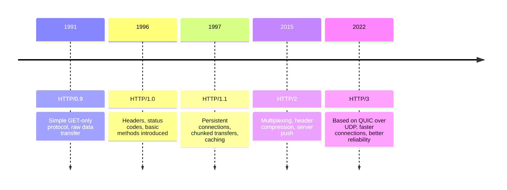
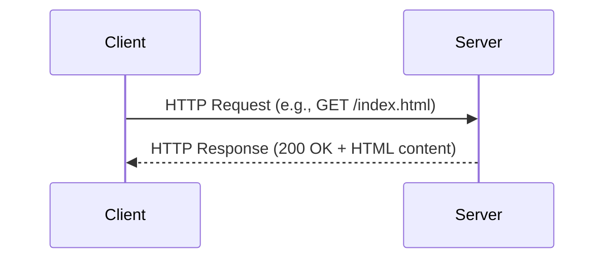

# What is HTTP?

Hypertext Transfer Protocol (HTTP) is the foundational communication protocol
used on the World Wide Web. It defines how messages are formatted and
transmitted between clients, typically web browsers, and servers hosting web
content. HTTP is an application-layer protocol built on top of the Transmission
Control Protocol (TCP) or, in the case of HTTP/3, the QUIC transport protocol
over UDP. Its primary purpose is to make web resources like HTML pages, images,
scripts, APIs, and other content accessible and deliverable across networks.

## Evolution of HTTP

HTTP has evolved through several versions:

- **HTTP/0.9 (1991):** A simple protocol supporting only raw data transfer
  through `GET` requests.
- **HTTP/1.0 (1996):** Introduced headers, status codes, and additional methods
  beyond `GET`.
- **HTTP/1.1 (1997):** Improved performance with persistent connections, chunked
  transfers, and caching mechanisms.
- **HTTP/2 (2015):** Enhanced efficiency through multiplexing, header
  compression, and server push capabilities.
- **HTTP/3 (2022):** Built on QUIC (a transport protocol running over UDP),
  offering faster connection establishment and improved reliability over modern
  networks.

## Core Model: Request and Response

HTTP follows a request-response model. A client sends an HTTP request to a
server, which processes the request and returns an HTTP response. The request
specifies a method, such as `GET` to retrieve data or `POST` to submit data, and
includes headers that convey metadata. The response includes a status code
indicating the outcome, e.g., `200 OK` for success, `404 Not Found` for missing
resources, along with the requested content or additional information.

## Stateless Nature

A defining characteristic of HTTP is that it is stateless. Each request is
treated as independent, with no inherent memory of previous interactions. This
design simplifies server implementation but also introduces challenges for
maintaining user sessions. To address this, mechanisms such as cookies,
sessions, and tokens are used to preserve state across multiple requests.

:::note

- **Cookies:** Small pieces of data stored on the client and sent with requests.
  They can hold session identifiers or user preferences.
- **Sessions:** Server-side tracking linked to a session identifier stored in a
  cookie. Sessions allow servers to maintain user state across multiple
  requests.
- **Tokens:** Like JSON Web Tokens (JWTs) used in Application Programming
  Interfaces (APIs) to validate authenticated users. Tokens are often included
  in request headers to authorize access to protected resources.

:::

## Importance in Modern Systems

HTTP underpins nearly all web interactions. It defines how browsers load pages,
how APIs communicate, and how distributed systems exchange data. Its simplicity,
extensibility, and widespread adoption have allowed it to remain relevant
despite decades of evolution and make it one of the most critical protocols in
modern networking.

## Summary

HTTP is the protocol that powers the web. Its design makes it a flexible and
widely adopted standard. Through improvements across versions, it continues to
provide the backbone for efficient communication across the Internet.
