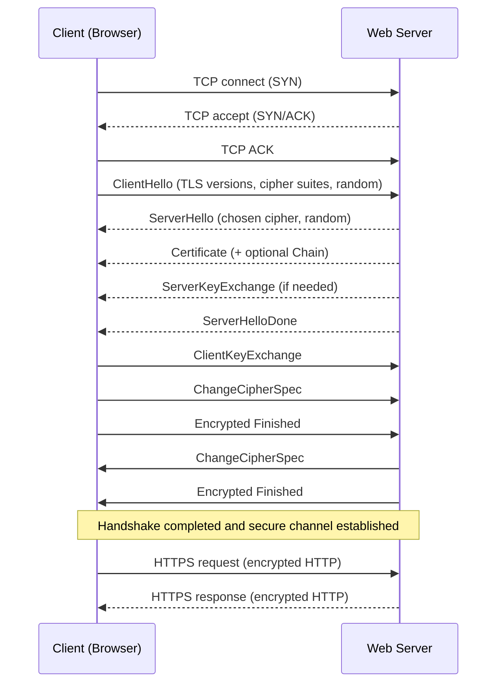
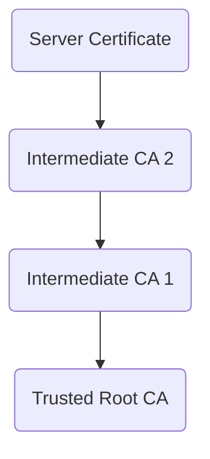

# What is HTTPS?

Hypertext Transfer Protocol Secure (HTTPS) is the secure version of HTTP, the
protocol used to communicate and transfer data between client (typically web
browser) and server. The key difference lies in the additional layer of security
provided by encryption, which protects data from being intercepted or tampered
during transmission.

## Difference from HTTP

HTTP transmits data in plain text, making it vulnerable to eavesdropping and
man-in-the-middle attacks. HTTPS, in contrast, protects data using encryption
and authentication mechanisms. This difference is especially critical for
websites handling sensitive information, such as banking platforms, e-commerce
services, and login systems.

## How HTTPS Works

HTTPS combines the standard HTTP protocol with the Secure Sockets Layer (SSL) or
its successor, Transport Layer Security (TLS). When a browser connects to a
website over HTTPS, the server presents a digital certificate issued by a
trusted Certificate Authority (CA). The browser and server perform a handshake
to agree on cryptographic parameters and to authenticate the server (and
optionally the client) using this digital certificate. The certificate verifies
identity and establishes an encrypted connection. Once the handshake completes,
application-layer HTTP requests and responses flow inside the established
encrypted channel. After that all data exchanged such as login credentials,
payment details, and personal information travels through this encrypted
channel, making it difficult for attackers to read or modify.

## Role of SSL/TLS Certificates

Certificates are essential for HTTPS. They confirm that a website is authentic
and not an impostor controlled by malicious actors. A valid certificate ensures
that the encryption keys used to secure the connection are trustworthy. Browsers
display visual indicators, such as a padlock icon, to show that a website uses
HTTPS. Invalid or expired certificates trigger warnings, signaling a potential
security risk.

## Structure of SSL/TLS Certificates

SSL/TLS certificates bind a public key to an entity (domain or organization) and
are issued by Certificate Authorities (CAs). Certificates form a chain from the
server certificate up through one or more intermediate certificates to a trusted
root CA present in the client's trust store. Browsers validate the chain, check
expiry and revocation status, and ensure the certificate matches the requested
domain before trusting the connection.

## Benefits of HTTPS

- **Confidentiality:** Encryption prevents unauthorized parties from reading
  transmitted data.
- **Integrity:** Data cannot be altered without detection while traveling
  between client and server.
- **Authentication:** Certificates verify that the client communicates with the
  intended server.
- **SEO Advantage:** Search engines favor HTTPS-enabled websites.
- **Trust:** Users gain confidence when accessing HTTPS-enabled websites.

## Modern Usage

Today, HTTPS is the standard across most of the web. Major browsers mark
non-HTTPS websites as "Not Secure," encouraging universal adoption. Services
such as [**Let's Encrypt**](https://letsencrypt.org) have made obtaining
certificates free and automated, lowering barriers to implementation.

## Summary

HTTPS is the foundation of secure web communication. By ensuring
confidentiality, integrity, and authentication, it protects both users and
website operators from security threats. Its widespread adoption reflects the
increasing importance of safeguarding data in the modern digital environment.
