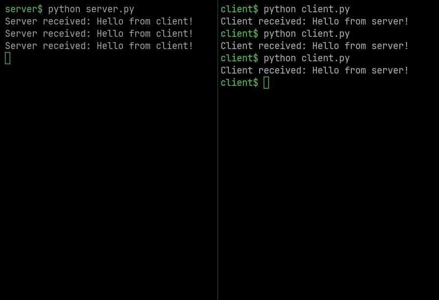

# Hello, aioquic! (QUIC implementation with Python)

<div className="center-image-and-caption">



</div>

## Overview

This project demonstrates a simple implementation of a QUIC client and server
using the `aioquic` library in Python. The server listens for incoming QUIC
connections and echoes back messages received from the client. The client
connects to the server, sends a message, and prints the response.

:::info

Go version:
[**Hello, quic-go! (QUIC implementation with Go)**](/snippets/hello-quic-go-quic-implementation-with-go/)

:::

## Feature Highlights

- **QUIC Protocol**: Utilizes the QUIC protocol for low-latency, multiplexed
  connections.
- **Asynchronous I/O**: Built with `asyncio` for efficient handling of multiple
  connections.
- **TLS Encryption**: Uses TLS for secure communication between client and
  server.
- **Self-signed Certificates**: Generates self-signed certificates for local
  testing.

## Screenshots

<div className="center-image-and-caption">


</div>

## Use Cases

- **Learning**: Understand the basics of QUIC and how to implement it in Python.
- **Prototyping**: Quickly prototype applications that require low-latency
  communication.
- **Testing**: Test QUIC-based applications in a local environment.

## Technologies Used

- [**Python**](https://www.python.org): The programming language used to build
  the application.
- [**aioquic**](https://aioquic.readthedocs.io/en/latest/): A Python library for
  QUIC and HTTP/3.
- [**asyncio**](https://docs.python.org/3/library/asyncio.html): Python's
  built-in library for writing concurrent code using the async/await syntax.
- [**OpenSSL**](https://www.openssl.org): A robust, full-featured open-source
  toolkit for SSL and TLS.

## Environment Setup

### Install Dependencies

A Python virtual environment and OpenSSL are required to be installed.

:::info

The following command is for Ubuntu and Debian-based distributions. For any
other OS or Linux distribution, check the relevant documentation.

:::

```shell title="Terminal"
sudo apt install python3-venv openssl
```

### Create Project Directory

```shell title="Terminal"
mkdir quic-python
cd quic-python
```

### Create and Activate Python Virtual Environment

```shell title="Terminal"
python -m venv venv
source venv/bin/activate
```

### Create Requirements File

Create a file named `requirements.txt` with the following content:

```plaintext
aioquic==1.2.0
attrs==25.3.0
certifi==2025.8.3
cryptography==45.0.6
pyasn1==0.6.1
pyasn1_modules==0.4.2
pycparser==2.22
pylsqpack==0.3.22
pyOpenSSL==25.1.0
service-identity==24.2.0
typing_extensions==4.14.1
```

### Install Python Dependencies

```shell title="Terminal"
pip install -r requirements.txt
```

### Generate Self-Signed Certificate for Localhost

:::warning

This certificate is for local testing purposes only. For production use, a
trusted Certificate Authority (CA) should be used.

:::

```shell title="Terminal"
openssl req \
  -new \
  -newkey rsa:2048 \
  -days 365 \
  -nodes \
  -x509 \
  -keyout key.pem \
  -out cert.pem \
  -subj "/CN=localhost" \
  -addext "subjectAltName=DNS:localhost"
```

## Code

### Create Server

Create a server file `server.py` with the following content:

```python title="server.py"
import asyncio
from aioquic.asyncio import QuicConnectionProtocol, serve
from aioquic.quic.configuration import QuicConfiguration


# Define server protocol (how to handle messages)
class ServerProtocol(QuicConnectionProtocol):
    def quic_event_received(self, event):
        if hasattr(event, "data"):  # If data is received
            print("Server received:", event.data.decode())
            # Echo back to client
            self._quic.send_stream_data(event.stream_id, b"Hello from server!")


# Run the QUIC server
async def main():
    config = QuicConfiguration(is_client=False)
    config.load_cert_chain("cert.pem", "key.pem")  # TLS cert required

    # Listen on localhost:4433
    await serve("localhost", 4433, configuration=config, create_protocol=ServerProtocol)
    await asyncio.get_running_loop().create_future()  # Keep server running


if __name__ == "__main__":
    asyncio.run(main())
```

### Create Client

Create a client file `client.py` with the following content:

```python title="client.py"
import asyncio
from aioquic.asyncio import connect, QuicConnectionProtocol
from aioquic.quic.configuration import QuicConfiguration
from aioquic.quic.events import StreamDataReceived


class ClientProtocol(QuicConnectionProtocol):
    def quic_event_received(self, event):
        if isinstance(event, StreamDataReceived):
            print("Client received:", event.data.decode())


async def main():
    config = QuicConfiguration(is_client=True)
    config.verify_mode = False  # disable TLS verification for local testing
    config.load_verify_locations("cert.pem")

    # Connect to server
    async with connect(
        "localhost", 4433, configuration=config, create_protocol=ClientProtocol
    ) as client:
        stream_id = client._quic.get_next_available_stream_id()
        client._quic.send_stream_data(stream_id, b"Hello from client!")

        # Keep running for a bit to receive server reply
        await asyncio.sleep(2)


if __name__ == "__main__":
    asyncio.run(main())
```

## Directory Structure

After creating the above files, project directory structure should look like
this:

```shell title="Terminal"
quic-python/
├── venv/
├── cert.pem
├── client.py
├── key.pem
├── requirements.txt
└── server.py
```

## Running the Application

### Run Server

Open a terminal, go to the project directory, activate the Python virtual
environment, and then run the following command:

```shell title="Terminal"
python server.py
```

### Run Client

Open another terminal, go to the same directory, activate the Python virtual
environment, and then run the following command:

```shell title="Terminal"
python client.py
```
