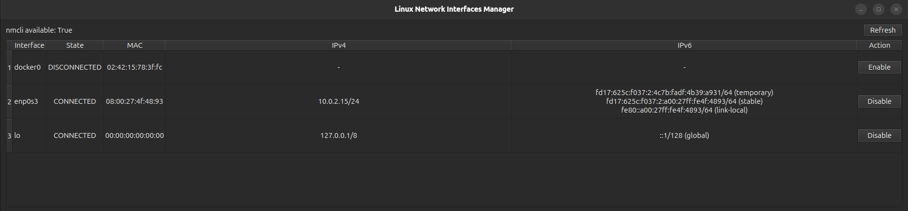
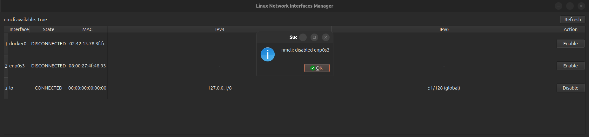
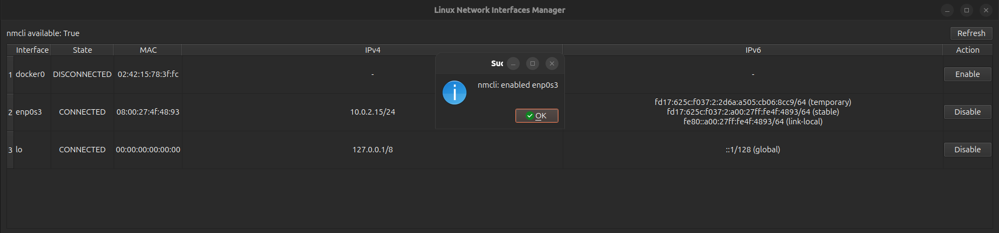

# Linux Network Interfaces Manager using PyQt6

<div className="center-image-and-caption">



</div>

## Overview

A desktop application built with PyQt6 to manage network interfaces on Linux
systems. It lists all network interfaces, displays their MAC addresses, IPv4 and
IPv6 addresses (with types), and allows enabling or disabling any interface.

## Feature Highlights

:::info

This application is designed to run on Linux systems only as it relies on
Linux-specific commands (`nmcli` and `ip`).

:::

- **List All Interfaces**: Displays all network interfaces on the system.
- **MAC Address Display**: Shows the MAC address of each interface.
- **IPv4 and IPv6 Addresses**: Lists both IPv4 and IPv6 addresses along with
  their types (link-local, global stable, temporary).
- **Enable/Disable Interfaces**: Provides buttons to enable or disable any
  network interface.
- **Uses `nmcli` or `ip`**: Utilizes `nmcli` if available for managing
  interfaces, otherwise falls back to `ip` command.

## Screenshots

<div className="center-image-and-caption">






</div>

## Use Cases

- **Network Management**: Easily manage network interfaces on Linux systems.
- **Troubleshooting**: Quickly enable or disable interfaces for troubleshooting
  network issues.
- **System Administration**: Useful tool for system administrators to monitor
  and manage network interfaces.

## Technologies Used

- [**Python**](https://www.python.org): The programming language used for the
  application.
- [**PyQt6**](https://pypi.org/project/PyQt6/): A set of Python bindings for Qt6
  application framework, used for building the GUI.
- [**subprocess**](https://docs.python.org/3/library/subprocess.html): Used to
  execute system commands (`nmcli` and `ip`).

## Environment Setup

:::info

Make sure Python 3 installed, this can checked by running `python3 --version` in
terminal.

:::

Install dependencies:

```shell title="Terminal"
pip install PyQt6
```

## Code

```python title="main.py"
"""Linux Network Interfaces Manager using PyQt6.

Capabilities:
- List all network interfaces
- Show MAC address
- Show IPv4 and IPv6 addresses with type (link-local, global stable,
  temporary)
- Enable/disable any interface

Notes:
- Uses `nmcli` if available, falls back to `ip`.
- Toggling interfaces usually requires root privileges, so may need to
  run with `sudo`.

Dependencies:
- PyQt6: `pip install PyQt6`

Run:
- `python3 main.py`
"""

import re
import shutil
import subprocess
import sys
from typing import Dict, List, Tuple

from PyQt6.QtCore import Qt, QTimer
from PyQt6.QtWidgets import (
    QApplication,
    QHBoxLayout,
    QHeaderView,
    QLabel,
    QMessageBox,
    QPushButton,
    QTableWidget,
    QTableWidgetItem,
    QVBoxLayout,
    QWidget,
)


def run_cmd(cmd: List[str]) -> Tuple[int, str, str]:
    try:
        proc = subprocess.run(
            cmd,
            capture_output=True,
            text=True,
            check=False,
        )
        return proc.returncode, proc.stdout.strip(), proc.stderr.strip()
    except Exception as e:
        return 1, "", str(e)


def parse_nmcli_status() -> Dict[str, str]:
    rc, out, err = run_cmd(["nmcli", "-t", "-f", "DEVICE,STATE", "device"])
    states = {}
    if rc == 0:
        for line in out.splitlines():
            if not line.strip():
                continue
            parts = line.strip().split(":")
            if len(parts) == 2:
                states[parts[0]] = parts[1]
    return states


def parse_ip_addr() -> Dict[str, Dict[str, List[str]]]:
    interfaces: Dict[str, Dict[str, List[str]]] = {}

    rc, out, err = run_cmd(["ip", "-o", "addr"])
    if rc != 0:
        return {}

    for line in out.splitlines():
        parts = line.split()
        if len(parts) < 4:
            continue
        ifname = parts[1]
        if ifname.endswith(":"):
            ifname = ifname[:-1]

        family = parts[2]
        addr = parts[3]
        flags = parts[4:]

        if ifname not in interfaces:
            interfaces[ifname] = {"state": "UNKNOWN", "mac": "", "ipv4": [], "ipv6": []}

        if family == "inet":
            interfaces[ifname]["ipv4"].append(addr)
        elif family == "inet6":
            label = "global"
            if "link" in flags:
                label = "link-local"
            elif "temporary" in flags:
                label = "temporary"
            elif "mngtmpaddr" in flags:
                label = "stable"
            interfaces[ifname]["ipv6"].append(f"{addr} ({label})")

    # Get link state and MAC
    rc, out_link, err = run_cmd(["ip", "-o", "link"])
    if rc == 0:
        for line in out_link.splitlines():
            m = re.match(
                r"(\d+): ([^:]+): .*state (\S+).*link/\S+ ([0-9a-f:]{17})", line
            )
            if m:
                ifname = m.group(2)
                state = m.group(3)
                mac = m.group(4)
                if ifname not in interfaces:
                    interfaces[ifname] = {
                        "state": state,
                        "mac": mac,
                        "ipv4": [],
                        "ipv6": [],
                    }
                else:
                    interfaces[ifname]["state"] = state
                    interfaces[ifname]["mac"] = mac

    # If nmcli is available, override state with nmcli's device state
    if nmcli_available():
        nmcli_states = parse_nmcli_status()
        for ifname, nmcli_state in nmcli_states.items():
            if ifname in interfaces:
                interfaces[ifname]["state"] = nmcli_state.upper()

    return interfaces


def nmcli_available() -> bool:
    return shutil.which("nmcli") is not None


def nmcli_toggle(iface: str, enable: bool) -> Tuple[int, str, str]:
    action = "connect" if enable else "disconnect"
    return run_cmd(["nmcli", "device", action, iface])


def ip_toggle(iface: str, enable: bool) -> Tuple[int, str, str]:
    action = "up" if enable else "down"
    return run_cmd(["sudo", "ip", "link", "set", "dev", iface, action])


class NetworkInterfacesManagerWidget(QWidget):
    def __init__(self, poll_interval_ms: int = 5000):
        super().__init__()
        self.setWindowTitle("Linux Network Interfaces Manager")
        self.resize(1100, 500)

        self.layout = QVBoxLayout(self)

        header_layout = QHBoxLayout()
        self.status_label = QLabel("")
        header_layout.addWidget(self.status_label)
        self._use_nmcli = nmcli_available()
        self.status_label.setText(f"nmcli available: {self._use_nmcli}")

        header_layout.addStretch()

        self.refresh_button = QPushButton("Refresh")
        self.refresh_button.clicked.connect(self.reload)
        header_layout.addWidget(self.refresh_button)

        self.layout.addLayout(header_layout)

        self.table = QTableWidget(0, 6)
        self.table.setHorizontalHeaderLabels(
            ["Interface", "State", "MAC", "IPv4", "IPv6", "Action"]
        )
        header = self.table.horizontalHeader()
        header.setSectionResizeMode(0, QHeaderView.ResizeMode.ResizeToContents)
        header.setSectionResizeMode(1, QHeaderView.ResizeMode.ResizeToContents)
        header.setSectionResizeMode(2, QHeaderView.ResizeMode.ResizeToContents)
        header.setSectionResizeMode(3, QHeaderView.ResizeMode.Stretch)
        header.setSectionResizeMode(4, QHeaderView.ResizeMode.Stretch)
        header.setSectionResizeMode(5, QHeaderView.ResizeMode.ResizeToContents)

        self.layout.addWidget(self.table)

        self.timer = QTimer(self)
        self.timer.setInterval(poll_interval_ms)
        self.timer.timeout.connect(self.reload)
        self.timer.start()

        self.reload()

    def reload(self):
        interfaces = parse_ip_addr()
        if not interfaces:
            QMessageBox.warning(
                self,
                "Error",
                "Failed to read network interfaces (requires 'ip' command).",
            )
            return

        self.table.setRowCount(0)
        for ifname, data in sorted(interfaces.items()):
            row = self.table.rowCount()
            self.table.insertRow(row)

            # Interface name
            if_item = QTableWidgetItem(ifname)
            if_item.setFlags(if_item.flags() ^ Qt.ItemFlag.ItemIsEditable)
            if_item.setTextAlignment(
                Qt.AlignmentFlag.AlignLeft | Qt.AlignmentFlag.AlignVCenter
            )
            self.table.setItem(row, 0, if_item)

            # State
            state_item = QTableWidgetItem(data.get("state", "UNKNOWN"))
            state_item.setFlags(state_item.flags() ^ Qt.ItemFlag.ItemIsEditable)
            state_item.setTextAlignment(
                Qt.AlignmentFlag.AlignHCenter | Qt.AlignmentFlag.AlignVCenter
            )
            self.table.setItem(row, 1, state_item)

            # MAC address
            mac_item = QTableWidgetItem(data.get("mac", "-"))
            mac_item.setFlags(mac_item.flags() ^ Qt.ItemFlag.ItemIsEditable)
            mac_item.setTextAlignment(
                Qt.AlignmentFlag.AlignHCenter | Qt.AlignmentFlag.AlignVCenter
            )
            self.table.setItem(row, 2, mac_item)

            # IPv4
            ipv4_list = data.get("ipv4", [])
            ipv4_item = QTableWidgetItem("\n".join(ipv4_list) if ipv4_list else "-")
            ipv4_item.setFlags(ipv4_item.flags() ^ Qt.ItemFlag.ItemIsEditable)
            ipv4_item.setTextAlignment(
                Qt.AlignmentFlag.AlignHCenter | Qt.AlignmentFlag.AlignVCenter
            )
            self.table.setItem(row, 3, ipv4_item)

            # IPv6
            ipv6_list = data.get("ipv6", [])
            ipv6_item = QTableWidgetItem("\n".join(ipv6_list) if ipv6_list else "-")
            ipv6_item.setFlags(ipv6_item.flags() ^ Qt.ItemFlag.ItemIsEditable)
            ipv6_item.setTextAlignment(
                Qt.AlignmentFlag.AlignHCenter | Qt.AlignmentFlag.AlignVCenter
            )
            self.table.setItem(row, 4, ipv6_item)

            # Action button
            btn = QPushButton()
            is_up = (
                data.get("state", "DOWN").upper() == "UP"
                or data.get("state", "DISCONNECTED").upper() == "CONNECTED"
            )
            btn = QPushButton("Disable" if is_up else "Enable")
            btn.setFixedSize(90, 28)  # constant button size
            container = QWidget()
            layout = QHBoxLayout(container)
            layout.addWidget(btn)
            layout.setContentsMargins(0, 0, 0, 0)
            layout.setAlignment(Qt.AlignmentFlag.AlignCenter)
            btn.clicked.connect(self.make_toggle_handler(ifname, not is_up))
            self.table.setCellWidget(row, 5, container)

        # Resize rows so wrapped text is visible
        self.table.setWordWrap(True)
        self.table.verticalHeader().setDefaultSectionSize(70)
        self.table.verticalHeader().setSectionResizeMode(QHeaderView.ResizeMode.Fixed)

    def make_toggle_handler(self, iface: str, enable: bool):
        def handler():
            self.toggle_interface(iface, enable)

        return handler

    def toggle_interface(self, iface: str, enable: bool):
        if self._use_nmcli:
            rc, out, err = nmcli_toggle(iface, enable)
            method = "nmcli"
        else:
            rc, out, err = ip_toggle(iface, enable)
            method = "ip"

        if rc == 0:
            QMessageBox.information(
                self,
                "Success",
                f"{method}: {'enabled' if enable else 'disabled'} {iface}",
            )
        else:
            QMessageBox.critical(
                self, "Failed", f"{method} returned {rc}\nstdout: {out}\nstderr: {err}"
            )

        self.reload()


def main():
    app = QApplication(sys.argv)
    w = NetworkInterfacesManagerWidget()
    w.show()
    sys.exit(app.exec())


if __name__ == "__main__":
    main()
```

## Running the Application

:::info

This application may require root privileges to enable or disable network
interfaces.

:::

Run the application using the following command:

```shell title="Terminal"
python3 main.py
```
