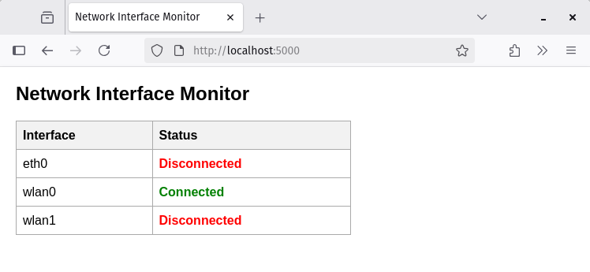
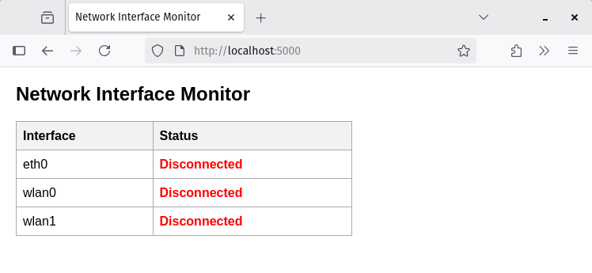
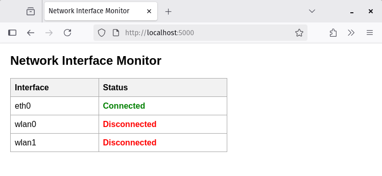

# Network Interface Monitor (Flask)

<div className="center-image-and-caption">



</div>

## Overview

This project is a simple Flask web application that monitors and displays the
status of physical network interfaces on a machine. It uses the `psutil` library
to gather network interface statistics and presents them in a user-friendly web
interface that refreshes every second.

:::info

PyQt5 version:
[**Network Interface Monitor (PyQt5)**](/snippets/network-interface-monitor-pyqt5/)

:::

## Feature Highlights

- **Real-time Monitoring**: The web page automatically refreshes every second to
  provide up-to-date information on the status of network interfaces.
- **Physical Interface Filtering**: The application filters out loopback and
  virtual interfaces, focusing only on physical network interfaces.
- **User-friendly Interface**: The status of each interface is clearly displayed
  with color coding for connected and disconnected states.

## Screenshots

<div className="center-image-and-caption">






</div>

## Use Cases

- **Network Administrators**: Monitor the status of physical network interfaces
  on servers or workstations.
- **System Monitoring**: Integrate into larger system monitoring solutions to
  keep track of network connectivity.

## Technologies Used

- [**Python**](https://www.python.org): The programming language used to build
  the application.
- [**Flask**](https://flask.palletsprojects.com/en/stable/): A lightweight web
  framework for Python.
- [**psutil**](https://psutil.readthedocs.io/en/latest/): A cross-platform
  library for retrieving information on running processes and system utilization
  (CPU, memory, disks, network, sensors) in Python.

## Environment Setup

:::info

Python 3.6 or higher is required. It is recommended to use a virtual environment
to manage dependencies.

:::

Install dependencies:

```shell title="Terminal"
pip install Flask psutil
```

## Code

:::danger

This application is intended for local use or within a trusted network. It does
not include authentication or security features. Do not expose it to the public
internet without proper security measures.

:::

:::warning

This application is designed for basic testing and educational purposes and
requires modifications to suit specific production environments. For example,
auto-refresh is not ideal for production use; WebSockets or AJAX for real-time
updates would be better solutions.

:::

```python title="main.py"
from flask import Flask, render_template_string
import psutil

app = Flask(__name__)

TEMPLATE = """
<!doctype html>
<html>
<head>
    <title>Network Interface Monitor</title>
    <meta http-equiv="refresh" content="1"> <!-- auto-refresh every 1 sec -->
    <style>
        body { font-family: Arial, sans-serif; margin: 20px; }
        table { border-collapse: collapse; width: 60%; }
        th, td { border: 1px solid #aaa; padding: 8px; text-align: left; }
        th { background-color: #f2f2f2; }
        .connected { color: green; font-weight: bold; }
        .disconnected { color: red; font-weight: bold; }
    </style>
</head>
<body>
    <h2>Network Interface Monitor</h2>
    <table>
        <tr><th>Interface</th><th>Status</th></tr>
        
        <tr>
            <td>{{ iface }}</td>
            <td class="{{ 'connected' if connected == 'Connected' else 'disconnected' }}">{{ connected }}</td>
        </tr>
        
    </table>
</body>
</html>
"""

def get_interfaces():
    stats = psutil.net_if_stats()
    results = []

    for iface, stat in stats.items():
        # skip loopback and virtuals
        if iface.startswith(("lo", "docker", "veth", "br", "virbr", "vmnet")):
            continue

        connected = "Connected" if stat.isup else "Disconnected"
        results.append((iface, connected))

    return results

@app.route("/")
def index():
    interfaces = get_interfaces()
    return render_template_string(TEMPLATE, interfaces=interfaces)

if __name__ == "__main__":
    app.run(host="127.0.0.1", port=5000)
```

## Running the Application

Run the application using the following command:

```shell title="Terminal"
python main.py
```

Open web browser and navigate to `http://localhost:5000` to view the network
interface status monitor.
