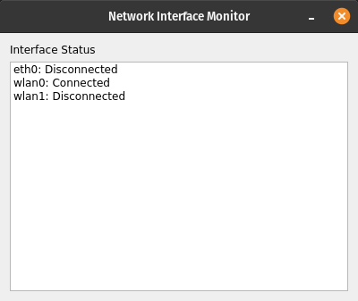
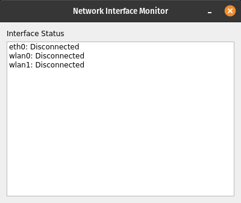
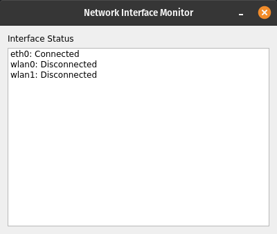

# Network Interface Monitor (PyQt5)

<div className="center-image-and-caption">



</div>

## Overview

This application uses PyQt5 for the graphical user interface and the `psutil`
library to fetch network interface statistics. It displays the status of
physical network interfaces, updating every second.

:::info

Flask version:
[**Network Interface Monitor (Flask)**](/snippets/network-interface-monitor-flask/)

:::

## Feature Highlights

- **Real-time Monitoring**: The application refreshes the status of network
  interfaces every second, providing up-to-date information.
- **Physical Interface Filtering**: It filters out virtual and loopback
  interfaces, focusing only on physical network connections.
- **User-friendly Interface**: The GUI is simple and easy to navigate, making it
  accessible to users of all levels.

## Screenshots

<div className="center-image-and-caption">






</div>

## Use Cases

- **Network Troubleshooting**: Quickly identify the status of physical network
  interfaces to diagnose connectivity issues.
- **System Monitoring**: Keep an eye on network interface statuses as part of
  overall system health monitoring.

## Technologies Used

- [**Python**](https://www.python.org): The programming language used for the
  application.
- [**PyQt5**](https://www.riverbankcomputing.com/software/pyqt/): A set of
  Python bindings for Qt libraries, used to create the GUI.
- [**psutil**](https://psutil.readthedocs.io/en/latest/): A cross-platform
  library for retrieving information on running processes and system utilization
  (CPU, memory, disks, network, sensors).

## Environment Setup

:::info

Python 3.6 or higher is required. It is recommended to use a virtual environment
to manage dependencies.

:::

Install dependencies:

```shell title="Terminal"
pip install psutil pyqt5
```

## Code

```python title="main.py"
import sys
import psutil
from PyQt5.QtWidgets import (
    QApplication,
    QWidget,
    QVBoxLayout,
    QLabel,
    QListWidget,
    QListWidgetItem,
)
from PyQt5.QtCore import QTimer


class NetworkMonitor(QWidget):
    def __init__(self):
        super().__init__()
        self.setWindowTitle("Network Interface Monitor")
        self.setGeometry(200, 200, 400, 300)

        layout = QVBoxLayout()
        self.list_widget = QListWidget()
        layout.addWidget(QLabel("Interface Status"))
        layout.addWidget(self.list_widget)
        self.setLayout(layout)

        self.timer = QTimer(self)
        self.timer.timeout.connect(self.update_status)
        self.timer.start(1000)  # refresh every 1 second

        self.update_status()

    def update_status(self):
        self.list_widget.clear()
        stats = psutil.net_if_stats()

        # Filter only physical interfaces
        for iface, stat in stats.items():
            if iface.startswith(("lo", "docker", "veth", "br", "virbr", "vmnet")):
                continue

            connected = "Connected" if stat.isup else "Disconnected"
            item_text = f"{iface}: {connected}"
            QListWidgetItem(item_text, self.list_widget)


if __name__ == "__main__":
    app = QApplication(sys.argv)
    window = NetworkMonitor()
    window.show()
    sys.exit(app.exec_())
```

## Running the Application

Run the application using the following command:

```shell title="Terminal"
python main.py
```
