# VirtualBox on Windows 11: Starter Guide

:::info

This is a beginner's guide to setting up and using VirtualBox on Windows 11 for
getting started with virtualization. The expected audience is anyone with no
experience in virtualization. This guide covers basic concepts of virtualization
and provides step-by-step instructions to install VirtualBox on Windows 11. If
you have experience with virtualization, you might find this guide too basic.

:::


Have you ever wanted to run multiple operating systems on your computer without
installing them on your physical machine? Or maybe you wanted to test some
software or configurations without affecting your main system? If so, then
virtualization might interest you.

{/* truncate */}

## What is Virtualization?

Virtualization is a technology that allows you to create virtual machines
(VMs)[^vm] that can run different operating systems and applications on a single
physical machine. This means you can run multiple operating systems on the same
machine, switch between them easily, and keep them isolated from each other.

The essence of virtualization is that it allows you to create a self-contained
environment that behaves like a separate computer but runs on top of your
existing hardware.

In later articles, I will cover more advanced topics related to virtualization,
such as hypervisors and their types, comparing different virtualization
software, creating and managing virtual machines, configuring networking, using
snapshots, and more. But for now, let's focus on getting started with VirtualBox
on Windows 11.

## What is VirtualBox?

[VirtualBox](https://www.virtualbox.org) is a free and open-source
hypervisor[^hypervisor] that allows you to create and manage virtual machines on
your computer. It is developed by [Oracle](https://www.oracle.com) and supports
various operating systems, including Windows, Linux, macOS, and Solaris.
VirtualBox is easy to use and has a user-friendly interface that makes it simple
to create, configure, and run virtual machines. It also supports advanced
features such as snapshots, shared folders, and network configurations, making
it a powerful tool for virtualization.

## Environment Details

This guide is specifically for installing VirtualBox on Windows 11. The
installation process may vary slightly depending on the version of Windows and VirtualBox you
are using, but the general steps should be similar. If you are using a different
version of Windows and VirtualBox, you can still follow this guide with minor adjustments.

<div class="center">

|                |              **Version** |
| :------------- | -----------------------: |
| **Windows 11** |                     24H2 |
| **VirtualBox** | 7.1.12 r169651 (Qt6.5.3) |

</div>

## Installing VirtualBox on Windows 11

To install VirtualBox on Windows 11, follow these steps:

### Download VirtualBox

Go to the [VirtualBox download page](https://www.virtualbox.org/wiki/Downloads)
and download the latest version of VirtualBox for Windows hosts.

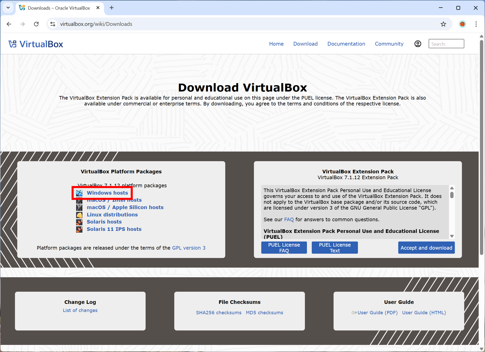

### Run the Installer

Once the download is complete, run the installer executable file. You may need
to grant permission to run the installer. The installation wizard will guide you
through the process. You can choose the default options (which are usually
sufficient for most users) or customize the installation according to your
preferences. Here, I am going to use the default options.


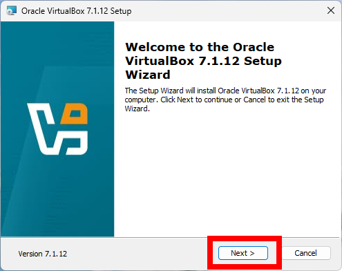


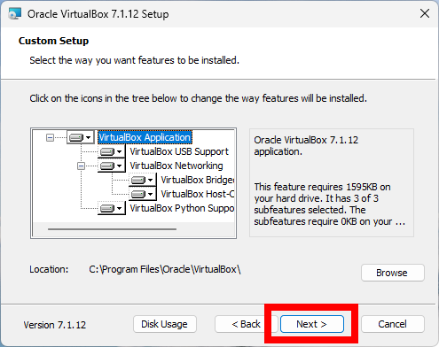


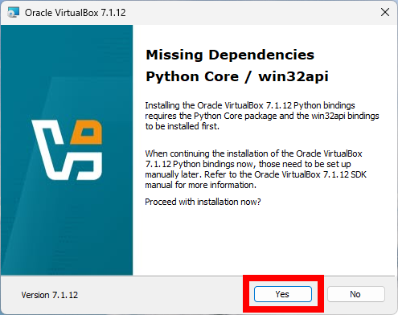

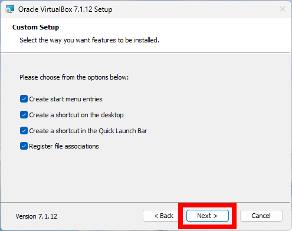


### Complete the Installation

After the installation is complete, you will see a confirmation screen. You can
choose to start VirtualBox immediately or close the installer. If you choose to
start VirtualBox, you will see the main window of the application.

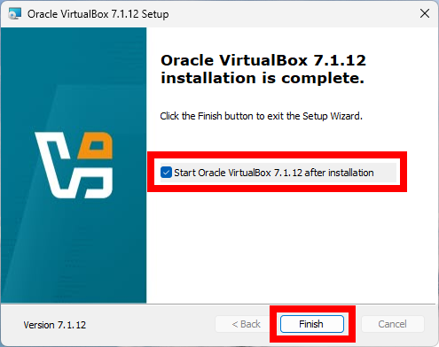

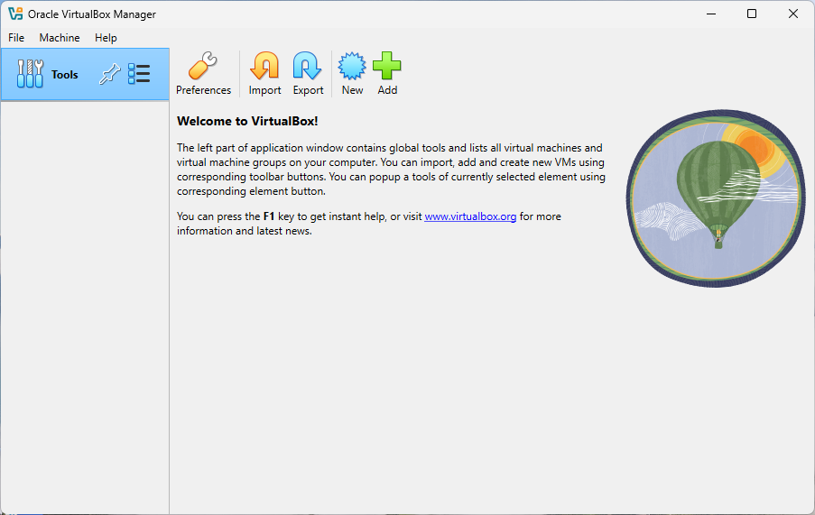

### Fixing Missing Dependencies: Python Core / win32api

You might encounter a warning related to missing dependencies: Python Core /
win32api when you try to run VirtualBox, as shown in the screenshot.


This is not an error but a warning and can be ignored unless you want to control
VirtualBox using Python scripts. If you want to remove this warning, you can
install the Python dependencies.

:::info

Consider installing Python if you haven't already. You can download it from
[Python.org](https://www.python.org/downloads/). As Python installation is not
within the scope of this article, I assume you already have Python installed on
your system.

:::

Open Command Prompt or Windows PowerShell as an administrator and run the
following command to install the required packages:

```console
pip install pywin32
```


After the installation is complete, you can verify it by running the following
command:

```console
python -c "import win32api; print(win32api.GetVersion())"
```

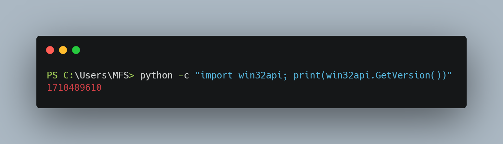

If you see the version number printed, the installation was successful.

### VirtualBox Extension Pack

After installing VirtualBox, it is recommended to install the VirtualBox
Extension Pack, which provides additional features and support for USB devices,
remote desktop, and other functionalities. Check this video for more
information:
[What is VirtualBox Extension Pack?](https://www.youtube.com/watch?v=vG8FkEjyE4E).

You can download the Extension Pack from the
[VirtualBox download page](https://www.virtualbox.org/wiki/Downloads) and
install it by double-clicking the downloaded file. Follow the prompts to
complete the installation.

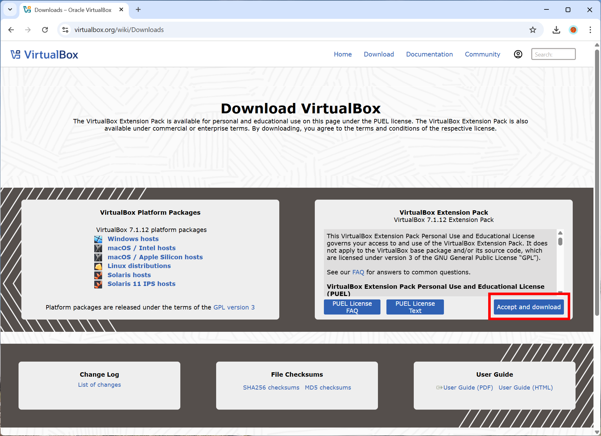

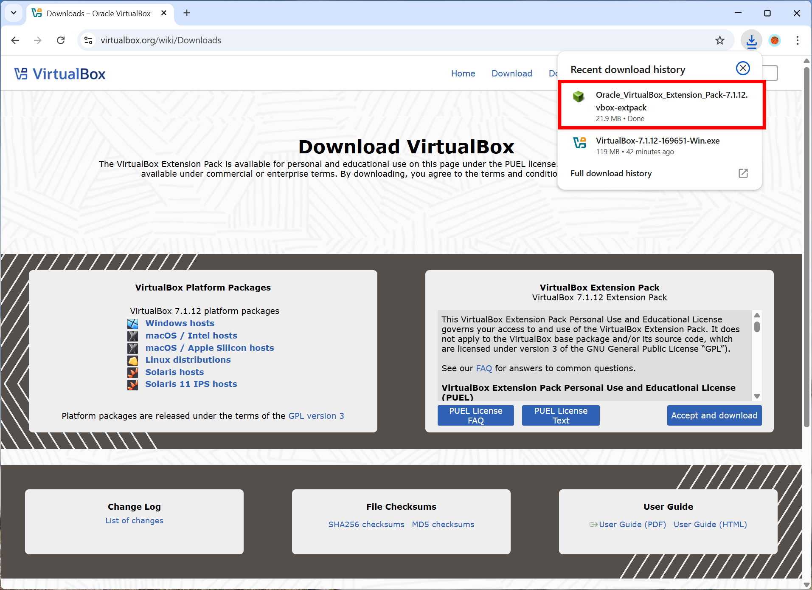


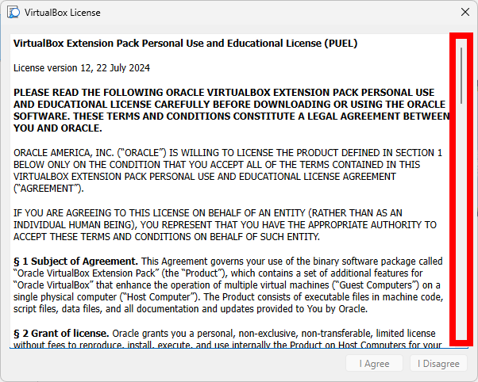


To verify the installation, follow these steps in the VirtualBox application:

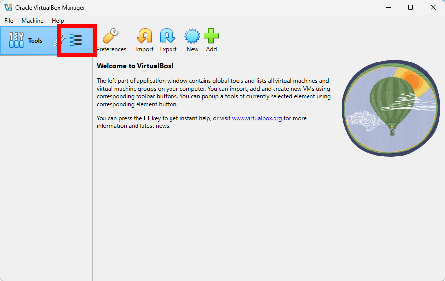


## Final Words

Now you have successfully installed VirtualBox on your Windows 11 machine and
are ready to create and run virtual machines. In the next articles, I will cover
how to create a virtual machine and install an operating system on it.

## Future Articles

In the future articles, I will cover the following related topics:

- Creating and managing virtual machines
- Configuring networking in virtual machines
- Using snapshots and backups
- Hypervisors, their types, and other virtualization software
- Advanced topics in virtualization
- Installing Python on Windows 11
- Using VirtualBox with Python scripts

---

[^hypervisor]:
    A hypervisor is software that creates and manages virtual machines.

[^vm]:
    A Virtual Machine (VM) is a software emulation of a physical computer that
    can run its own operating system and applications independently of the host
    system.
